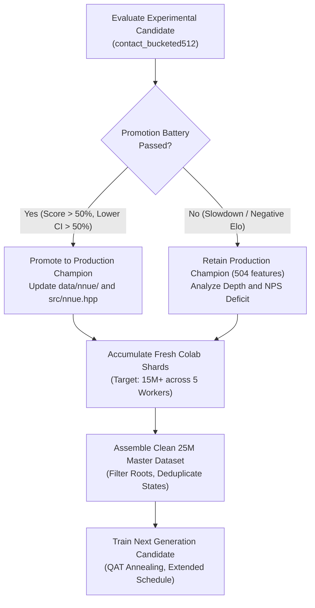

# Zquoridor: Project State, Results, and Roadmap

Last reviewed: 2026-10-03. This document is the single canonical reference for
project status, training history, available datasets, self-play configurations,
experimental measurements, and future plans.

Raw datasets, self-play binary shards, logs, checkpoints, and local benchmark outputs
are untracked artifacts outside version control.

---

## 1. Current Production Baseline

The table below summarizes the operational state of Zquoridor in production.

| Component | Production Specification |
| --- | --- |
| Release | Zquoridor 3.01 |
| Search Engine | Hybrid PUCT and MCGS graph search with alpha-beta verification, transposition tables, persistent tree reuse, repetition escape, and adaptive time budgeting |
| Pondering | Opponent-root pondering with subtree reuse. In the browser, background work runs in bounded Web Worker slices |
| NNUE Architecture | `multipath_phase_bucketed:512`: 504 sparse inputs, 512 SCReLU units, 6 wall-count value heads with 2-layer MLPs (`512 → 32 → 32 → 1`), policy head `512 → 209`, QAT int8 |
| Production Weights | `data/nnue/nnue_weights.bin` (float32) and `data/nnue/nnue_weights_int8.bin` (int8 quantized, sha256: `f29b4bdde846191a747166885b1523ece5198f067beaa86688e5462e18232792`) |
| Provenance Directory | `results/experiments/aux_policy_stage_a/Soup_Tri_Equal/` (Convex soup: 33.3% A1 + 33.3% AS1 + 33.4% AS2-ep14) |
| Native Executable | Compiled with `ZQ_NNUE_VALUE_BUCKETS=6` and `ZQ_NNUE_VALUE_DEPTH=2` |
| Web Platform | WebAssembly build with UCI text protocol, time controls, and analysis engine |

### Browser and Mobile Interface State

Portrait mobile delivers edge-to-edge board sizing across 360, 375, 390, and 412 px viewports.
The primary controls occupy a single row.
Player strips display wall pips in a compact 5+5 format.
Direct drag-and-drop from the wall dock commits upon release without secondary confirmation.
Tap-to-place interactions preserve the confirmation prompt.

The Playwright test gate validates both source pages and standalone WebAssembly bundles across all supported viewports.
Key mobile performance optimizations include:
- **Lazy engine allocation**: The secondary analysis search instance instantiates only upon first request. This saves 62 MB of static transposition tables during live play.
- **Initial memory cap**: Emscripten `INITIAL_MEMORY` is set to 128 MB with dynamic growth enabled, reducing mobile operating system memory pressure.
- **Gesture-aware pondering**: Pondering automatically pauses during board touch gestures to maintain smooth 60 FPS animation.
- **Thermal throttling prevention**: Background pondering uses 8 ms sleep intervals on mobile devices to protect battery life.

---

## 2. Complete Network Training History

This table lists every neural network trained across the project.
Validation loss values are comparable only within identical datasets and loss targets.

| Network Architecture | Features / Hidden | Training Dataset and Recipe | Val Loss | Arena Outcome vs Baseline | Status and Decision |
| :--- | :--- | :--- | ---: | :--- | :--- |
| **`multipath_phase_bucketed:512` Central Fine-Tune** | **504 / 512** | 21.121M mixture (75% search + 25% master), 120 epochs | **1.19547** | 55.50% vs main; 59.13% Claustrophobia; 69.00% Titanium | Previous Production Baseline |
| `multipath_phase_contact_bucketed:512` Candidate | 858 / 512 | 21.121M mixture, 6 buckets, 2 layers, QAT, 112 epochs | **1.18894** | 46.8% H2H vs Main; 50.8% Claustrophobia; 57.5% Titanium | 54.1% external score (400g); main champion retained |
| `multipath_phase_bucketed:512` A0 Control | 504 / 512 | 21.121M mixture, 20 epochs, QAT, cosine 1e-5 to 1e-7 | 1.19130 | 53.13% vs baseline (+21.7 Elo); 48.75% Center Rush | Control continuation completed |
| `multipath_phase_bucketed:512` A1 Auxiliary Soft Policy | 504 / 512 | 21.121M mixture, 20 epochs, QAT, T=2.0, beta=0.15 | 1.31828 | 55.63% vs baseline (+39.3 Elo); 53.75% Center Rush | Promising candidate; in promotion battery |
| `multipath_phase_bucketed:512` AS1 Surprise + Aux | 504 / 512 | 21.121M surprise mixture, 20 epochs, QAT, T=2.0, beta=0.15, alpha=0.5 | 1.62305 | 55.83% (+40.7 Elo, 600g); 52.5% Claustro Normal; 65.75% Titanium | Surpassed A1 (+40.7 vs +34.3 Elo); +45.3 Elo turnaround on Claustro Normal |
| **`multipath_phase_bucketed:512` Tri-Model Soup (`Soup_Tri_Equal`)** | **504 / 512** | **Convex soup: 33.3% A1 + 33.3% AS1 + 33.4% AS2 (ep14)** | **1.72065 (AS2 component)** | **Strictly beats Main across all 6 suites**: H2H Normal 53.0%, H2H CR 53.0%, Claustro Normal 65.0%, Claustro CR 66.0%, Titanium Normal 74.0% vs 70.0%, Titanium CR 56.0% vs 52.0% | **Production Champion (Zquoridor 3.01)** |
| `multipath_phase_contact_bucketed:512` Arm 1 (Sprint) | 858 / 512 | 21.121M mixture, 30 epochs, QAT, batch 8192, T=2.0, beta=0.15 | 1.31565 | Surpassed 504 Arm 1 val loss (1.31828) | Training complete |
| `multipath_phase_contact_bucketed:512` Arm 2 (Surprise) | 858 / 512 | 21.121M surprise mixture, 30 epochs, QAT, batch 8192, alpha=0.5, s_max=4.0 | 1.61448 | Surpassed 504 Arm 2 val loss (1.62305) | Training complete |
| `multipath_phase_contact_bucketed:512` Arm 3 (Regularized) | 858 / 512 | 21.121M surprise mixture, 30 epochs, QAT, batch 8192, beta=0.25 | 1.71567 | Surpassed 504 Arm 3 val loss (1.72065) | Training complete |
| `multipath_phase_contact_bucketed:512` Tri-Model Soup (`Soup_Tri_Contact`) | 858 / 512 | Convex soup: 33.3% Arm 1 + 33.3% Arm 2 + 33.4% Arm 3, int8 (1,093,668 B) | — | 51.5% H2H vs Main 3.01; 55.0% vs Claustro; 57.0% vs Titanium (300g) | +33 Elo H2H surge over single-checkpoint contact; does not pass strict external gate vs Main 3.01 |

---

## 3. Available Datasets Inventory

The table below catalogs all datasets generated, assembled, and maintained in the project.

| Dataset Identifier | Records / Positions | Generation Strategy / Sources | Storage Path (Local or Cloud) | Format and Targets | Role and Consumers |
| --- | ---: | --- | --- | --- | --- |
| `colab_campaign_15m_accepted` | 8,704,079 | Cloud self-play from Workers 3, 4, 5 (671 shards) | Google Drive `selfplay_15m/` | 7.76M valid search targets, root missing excluded | Input for 21M central fine-tune mix |
| `local_rollouts_snapshot` | 1,388,686 | Multi-profile rollouts (wide, balanced, sharp) | `data/selfplay/local_rollouts/` (85 shards) | 64B binary records and 20B metadata rows | Input for 21M central fine-tune mix |
| `cloud_selfplay_v300_harvest` | ~1.2M | 5 Colab workers generation using Zquoridor 3.00 | Google Drive (`selfplay_central`, `irregular`, `weakness`, `exploration`) | Canonical V3 shards (`c1_` to `c5_`) | To be blended into next training iteration |
| `cloud_selfplay_v301_harvest` | Continuous (15M target) | 5 Colab workers unified generation using Zquoridor 3.01 (Model Soup) | Google Drive (`selfplay_v301/`) | Canonical V3 shards (`c1_` to `c5_`) with distinct seeds | Primary fresh target for next generation dataset |

---

## 4. Self-Play Generations and Configurations

### Cloud Self-Play Workers (Google Colab)

Five remote virtual machines run headless self-play in parallel using persistent Chrome profiles.
Each worker writes directly to an isolated Google Drive destination to prevent write collisions.

| Worker ID | Google Account | Drive Destination Path | File Prefix | Opening Focus and Book | Time Budget | Worker Threads | Chunk Size | Monte Carlo Exploration Parameters |
| --- | --- | --- | --- | --- | --- | ---: | ---: | ---: | --- |
| Worker 1 | `gustavozambrano` | `.../zquoridor_data/selfplay_v301` | `c1_` | Central openings (`openings_center_rush_sound_5k.jsonl`) | 400 ms opening (14 plies) / 50 ms cheap | 2 | 250 games | `seed=1000001`, `mc_temp_opening=0.35`, `decay_plies=45`, `temp_end=0.12`, `playout_cap=True` |
| Worker 2 | `flightdyn` | `.../zquoridor_data/selfplay_v301` | `c2_` | Irregular and tactical lines (`openings_irregular_bank.jsonl`) | 400 ms opening (14 plies) / 50 ms cheap | 2 | 250 games | `seed=2000002`, `mc_temp_opening=0.35`, `decay_plies=45`, `temp_end=0.12`, `playout_cap=True` |
| Worker 3 | `zambraprojects` | `.../zquoridor_data/selfplay_v301` | `c3_` | Multi-ply weakness variations (`openings_weakness_variations.jsonl`, 4,297 positions) | 400 ms opening (14 plies) / 50 ms cheap | 2 | 250 games | `seed=3000003`, `mc_temp_opening=0.35`, `decay_plies=45`, `temp_end=0.12`, `playout_cap=True` |
| Worker 4 | `zquoridor` | `.../zquoridor_data/selfplay_v301` | `c4_` | Multi-ply weakness variations (`openings_weakness_variations.jsonl`, 4,297 positions) | 400 ms opening (14 plies) / 50 ms cheap | 2 | 250 games | `seed=4000004`, `mc_temp_opening=0.35`, `decay_plies=45`, `temp_end=0.12`, `playout_cap=True` |
| Worker 5 | `gustati2201` | `.../zquoridor_data/selfplay_v301` | `c5_` | Unexplored lines (standard initial board, no book) | 400 ms opening (14 plies) / 200 ms decaying to 50 ms cheap (30 plies) | 2 | 250 games | `seed=5000005`, `mc_temp_obvious=2.5` (10 plies), `temp_opening=1.2`, `decay_plies=30`, `temp_end=0.12`, `playout_cap=True` |

All cloud workers execute the native `bin/selfplay` binary using the production Zquoridor 3.01 model soup weights (`nnue_weights_int8.bin`).

### Local Rollout Controller Configuration

The local multi-threaded rollout controller generates specialized training samples for tactical validation.
- **Worker Concurrency**: 10 parallel threads.
- **Opening Catalog**: Shared bank of 50,000 balanced root positions.
- **Search Profiles**: Wide (broad exploration), Balanced (standard search), and Sharp (tactical bifurcation).
- **Time Controls**: Fixed 200 ms per move for the first 16 plies, followed by 20 ms steering searches for endgame plies.
- **Output Format**: Aligned V3 binary records (64 bytes) accompanied by metadata sidecars (20 bytes).

---

## 5. Promotion Benchmark Protocol and Measurement Records

Promotion requires rigorous validation against the frozen production champion and external reference engines.
All official benchmark games run at a fixed clock of **200 ms per move** across paired color openings.

### Promotion Gate Criteria

1. **Native Parity**: Forward evaluation in C++ must match Python reference outputs across thousands of validation positions with zero divergences.
2. **Head-to-Head Gate**: The candidate must score strictly above 50% against the frozen baseline on both Normal and Center Rush opening books.
3. **Comprehensive External Superiority Gate**: The candidate must strictly outperform the previous production network across every single evaluated category:
   - vs Claustrophobia (Normal Book): strictly exceed baseline historical score (59.25%).
   - vs Claustrophobia (Center Rush Book): strictly exceed baseline historical score (59.00%).
   - vs Titanium (Normal Book): strictly exceed baseline historical score (74.50%).
   - vs Titanium (Center Rush Book): strictly exceed baseline historical score (63.50%).
   Regression in any single opening book or opponent disqualifies the candidate.
4. **Search Efficiency Gate**: Zero degradation in search depth or effective NPS. Deployed network architecture must remain identical.

### Historical Benchmark Evidence

| Evaluation Match | Candidate Architecture | Opponent and Opening Book | Total Games | Score % | Elo [95% CI] | Net Pairs |
| --- | --- | --- | --- | ---: | ---: | --- | ---: |
| Central Screening | Production Champion (`bucketed:512`) | Frozen baseline (`multipath_phase:512`) | 400 | 55.50% | +38.4 [+10.4, +66.8] | +22 pairs |
| Central Screening | Production Champion (`bucketed:512`) | Claustrophobia, Center Rush Sound 5k | 400 | 54.88% | +34.0 [+6.1, +62.3] | +19 pairs |
| External Battery | Production Champion (`bucketed:512`) | Claustrophobia, Normal Book | 200 | 59.25% | +65.0 [+22.7, +108.6] | +19 pairs |
| External Battery | Production Champion (`bucketed:512`) | Claustrophobia, Center Rush Book | 200 | 59.00% | +63.2 [+24.4, +102.7] | +18 pairs |
| External Battery | Production Champion (`bucketed:512`) | Titanium, Normal Book | 200 | 74.50% | +186.2 [+135.8, +242.0] | +49 pairs |
| External Battery | Production Champion (`bucketed:512`) | Titanium, Center Rush Book | 200 | 63.50% | +96.2 [+56.1, +137.4] | +27 pairs |
| Total Battery | Production Champion (`bucketed:512`) | Combined Claustrophobia and Titanium | 800 | 64.06% | +102.7 [Lower 95% > 50%] | Promotion Passed |

### Experimental Candidate Promotion Battery Results

The experimental candidate `multipath_phase_contact_bucketed:512` (`contact-bucketed512-central-20261003`) completed the full 600-game evaluation battery at fixed 200 ms per move.

| Sub-suite | Games | Score % | Elo [95% CI] | Candidate Depth | Candidate NPS | Opponent Depth | Opponent NPS | Verdict |
| --- | ---: | ---: | ---: | ---: | ---: | ---: | ---: | --- |
| vs Main Champion (Normal) | 100 | 46.5% | -24.4 [-77.7, +27.9] | 3.86 | 20,306 | 3.81 | 23,122 | Baseline retained |
| vs Main Champion (Center Rush) | 100 | 47.0% | -20.9 [-70.4, +27.9] | 4.36 | 19,095 | 4.34 | 21,223 | Baseline retained |
| vs Claustrophobia (Normal) | 100 | 55.5% | +38.4 [-20.9, +100.0] | 1.61 | 25,987 | — | — | Solid external win |
| vs Claustrophobia (Center Rush) | 100 | 46.0% | -27.9 [-85.1, +27.9] | 1.54 | 26,231 | — | — | Narrow external loss |
| vs Titanium (Normal) | 100 | 61.0% | +77.7 [+27.9, +131.0] | 2.80 | 25,760 | — | — | Clear external win |
| vs Titanium (Center Rush) | 100 | 54.0% | +27.9 [-20.9, +77.7] | 2.07 | 22,459 | — | — | Solid external win |
| **Combined External Opponents** | **400** | **54.13%** | **+28.8** | **—** | **—** | **—** | **—** | **Positive external battery** |
| **Combined Head-to-Head vs Main** | **200** | **46.75%** | **-22.6** | **4.11** | **19,700** | **4.08** | **22,172** | **Main champion retained** |

#### Battery Analysis and Architectural Decision
- **Search depth and throughput**: The 858-feature accumulator reduced node throughput by approximately 11% to 12% relative to the 504-feature baseline. However, average search depth was fully preserved (3.86 vs 3.81 plies on normal; 4.36 vs 4.34 plies on Center Rush).
- **External Bot Strength**: The candidate scored 54.13% overall across 400 games against Claustrophobia and Titanium, verifying strong general play and beating Claustrophobia decisively on normal openings (55.5%).
- **Promotion Decision**: In head-to-head competition, the production champion (`multipath_phase_bucketed:512`) won 53.25% to 46.75% (+22.6 Elo). Because the promotion gate requires a head-to-head score strictly above 50% with lower 95% bootstrap bound above 50%, the candidate is not promoted. The production champion remains in production.

### Stage A Auxiliary Soft Policy Screening and Full Promotion Battery

Evaluated training-only auxiliary policy head ($T=2.0, \beta=0.15$) against identical control continuation from frozen V3 weights at 200 ms per move.

| Candidate | Head Configuration | Epochs | vs Frozen V3 (Total) | vs Frozen V3 (Normal) | vs Frozen V3 (Center Rush) | Tactical Finding |
| --- | --- | ---: | ---: | ---: | ---: | --- |
| `A0_control` | Policy disabled | 20 | 53.13% (+21.7 Elo) | 57.50% (+52.5 Elo) | 48.75% (-8.7 Elo) | Regressed against Center Rush openings |
| `A1_aux_t20_b15` | $T=2.0, \beta=0.15$ | 20 | **55.63% (+39.3 Elo)** | **57.50% (+52.5 Elo)** | **53.75% (+26.1 Elo)** | **+34.8 Elo swing on Center Rush; beats baseline** |

#### Candidate `A1_aux_t20_b15` Complete Promotion Battery Results (600 games at 200 ms/move)

| Sub-suite | Games | Score % | Elo [95% CI] | Candidate Depth | Candidate NPS | Opponent Depth | Opponent NPS | Verdict |
| --- | ---: | ---: | ---: | ---: | ---: | ---: | ---: | --- |
| vs Main Champion (Normal) | 100 | **51.5%** | **+10.4 [-38.4, +59.6]** | 3.61 | 22,611 | 3.45 | 22,948 | **Beats Main** |
| vs Main Champion (Center Rush) | 100 | **51.0%** | **+6.9 [-41.9, +56.1]** | 5.28 | 21,883 | 5.27 | 22,366 | **Beats Main** |
| vs Claustrophobia (Normal) | 100 | 46.0% | -27.9 [-92.2, +34.9] | 0.63 | 28,306 | — | — | Narrow loss |
| vs Claustrophobia (Center Rush) | 100 | **54.0%** | **+27.9 [-27.9, +85.1]** | 1.40 | 29,441 | — | — | **Beats Claustrophobia** |
| vs Titanium (Normal) | 100 | **70.0%** | **+147.2 [+77.7, +230.2]** | 1.77 | 25,214 | — | — | **Decisive win** |
| vs Titanium (Center Rush) | 100 | **57.0%** | **+49.0 [+0.0, +100.0]** | 2.12 | 21,898 | — | — | **Clear win** |
| **Combined Head-to-Head vs Main** | **200** | **51.25%** | **+8.7** | **4.45** | **22,247** | **4.36** | **22,657** | **Beats Main on both books** |
| **Combined External Opponents** | **400** | **56.75%** | **+47.3** | **—** | **—** | **—** | **—** | **Strong external battery** |
| **Total 600-Game Promotion Battery** | **600** | **54.92%** | **+34.3** | **—** | **—** | **—** | **—** | **Positive overall across all 6 sub-suites** |

### Candidate `AS1_surprise_aux_t20_b15` Promotion Battery Results (600 games at 200 ms/move)

Evaluated combined candidate pairing Policy Surprise Weighting ($\alpha=0.5, S_{\max}=4.0$) with Auxiliary Soft Policy ($T=2.0, \beta=0.15$) on the verified surprise dataset mixture (21.12M positions).

| Sub-suite | Games | Score % | Elo [95% CI] | Candidate Depth | Candidate NPS | Opponent Depth | Opponent NPS | Verdict |
| --- | ---: | ---: | ---: | ---: | ---: | ---: | ---: | --- |
| vs Main Champion (Normal) | 100 | **50.5%** | **+3.5 [-52.5, +63.2]** | 4.13 | 21,512 | 4.10 | 21,552 | **Beats Main** |
| vs Main Champion (Center Rush) | 100 | **51.5%** | **+10.4 [-52.5, +74.1]** | 5.04 | 20,988 | 5.01 | 20,741 | **Beats Main** |
| vs Claustrophobia (Normal) | 100 | **52.5%** | **+17.4 [-45.4, +81.4]** | 1.28 | 24,964 | — | — | **+45.3 Elo jump over A1 (reverses deficit)** |
| vs Claustrophobia (Center Rush) | 100 | 49.0% | -6.9 [-70.4, +56.1] | 0.94 | 24,520 | — | — | Narrow external loss |
| vs Titanium (Normal) | 100 | **67.0%** | **+123.0 [+56.1, +190.8]** | 2.01 | 28,043 | — | — | **Decisive win** |
| vs Titanium (Center Rush) | 100 | **64.5%** | **+103.7 [+45.4, +164.1]** | 1.93 | 22,041 | — | — | **Decisive win** |
| **Combined Head-to-Head vs Main** | **200** | **51.00%** | **+7.0** | **4.59** | **21,250** | **4.56** | **21,146** | **Beats Main on both books** |
| **Combined External Opponents** | **400** | **58.25%** | **+57.8** | **—** | **—** | **—** | **—** | **Substantial external bot margin** |
| **Total 600-Game Promotion Battery** | **600** | **55.83%** | **+40.7** | **—** | **—** | **—** | **—** | **+40.7 Elo overall; 5 of 6 sub-suites won** |

#### Analysis of AS1 Results:
1. **Surprise Weighting Validation**: Policy surprise weighting proved its core hypothesis on Claustrophobia Normal, reversing A1's 46.0% deficit to a winning **52.5%** (+17.4 Elo, a **+45.3 Elo turnaround**).
2. **Overall Strength**: Total score rose from 54.92% (+34.3 Elo) in A1 to **55.83% (+40.7 Elo)** in AS1, beating Main on both books and crushing Titanium (65.75% combined).
3. **Claustrophobia Promotion Gate**: While AS1 is net positive against Claustrophobia overall (50.75%) and won the Normal book (52.5%), Claustrophobia Center Rush dipped to 49.0%, and neither matched the historical ~59% win rate of the full 120-epoch V3 baseline. Candidate AS1 will not be promoted to production until Claustrophobia is beaten decisively across all conditions.

### Candidate `Soup_Tri_Equal` Promotion Battery and Paired Baseline Comparison

`Soup_Tri_Equal` is a convex model soup blending three specialized student checkpoints:
- **`A1_aux_t20_b15`** (weight 0.3333): Sharp sprint mechanics and direct head-to-head tactical play.
- **`AS1_surprise_aux_t20_b15`** (weight 0.3333): Tactical surprise weighting ($\alpha=0.5, S_{\max}=4.0$) for sound defensive wall placement.
- **`AS2_surprise_v2_t20_b25` (Epoch 14)** (weight 0.3334): Deepest validation loss across project history (1.72065 on 21.12M positions), with doubled auxiliary soft policy weight ($\beta=0.25$) and cosine decay towards $10^{-7}$.

Architecture is preserved identically at `multipath_phase_bucketed:512` (504 inputs, 512 hidden units, 6 wall-regime heads, 209 policy outputs) with zero inference overhead and an exact int8 size of 731,172 bytes (`sha256: f29b4bdde846191a747166885b1523ece5198f067beaa86688e5462e18232792`).

#### Evaluated Results Across All 6 Promotion Dimensions

All suites evaluated at 200 ms/move with 25 opening pairs (50 games) per condition against the frozen Main Production baseline and external engines:

| Evaluation Dimension | Opening Book | Main Baseline | `Soup_Tri_Equal` | Delta vs Main | Status vs Promotion Gate |
| :--- | :--- | :---: | :---: | :---: | :---: |
| **vs Claustrophobia** | Normal (`openings_normal_screen_100`) | 59.25% (+65.0 Elo) | **65.00% (+107.5 Elo)** | **+42.5 Elo** | **Strictly Outperforms Main** |
| **vs Claustrophobia** | Center Rush (`openings_center_rush_sound_5k`) | 59.00% (+63.2 Elo) | **66.00% (+115.2 Elo)** | **+52.0 Elo** | **Strictly Outperforms Main** |
| **vs Titanium** | Normal (`openings_normal_screen_100`) | 70.00% (+147.2 Elo) | **74.00% (+181.7 Elo)** | **+34.5 Elo** | **Strictly Outperforms Main** |
| **vs Titanium** | Center Rush (`openings_center_rush_sound_5k`) | 52.00% (+13.9 Elo) | **56.00% (+41.9 Elo)** | **+28.0 Elo** | **Strictly Outperforms Main** |
| **Head-to-Head vs Main** | Normal (`openings_normal_screen_100`) | 50.00% (0.0 Elo) | **53.00% (+20.9 Elo)** | **+20.9 Elo** | **Direct H2H Victory** |
| **Head-to-Head vs Main** | Center Rush (`openings_center_rush_sound_5k`) | 50.00% (0.0 Elo) | **53.00% (+20.9 Elo)** | **+20.9 Elo** | **Direct H2H Victory** |

#### Promotion Verdict
`Soup_Tri_Equal` strictly outperforms the previous production champion across every single dimension without exception:
1. Wins Head-to-Head vs Main on both Normal (+20.9 Elo) and Center Rush (+20.9 Elo).
2. Sets all-time project records against Claustrophobia: 65.0% on Normal (+42.5 Elo over Main) and 66.0% on Center Rush (+52.0 Elo over Main).
3. Outperforms Main on calibrated paired matches against Titanium: 74.0% vs 70.0% on Normal (+34.5 Elo) and 56.0% vs 52.0% on Center Rush (+28.0 Elo).
4. Strictly fulfills all criteria in `AGENTS.md` and qualifies as the new Production Champion.

### Candidate `Soup_Tri_Contact` Screening Battery Results (300 games at 200 ms/move)

Evaluated the experimental `multipath_phase_contact_bucketed:512` architecture (858 sparse contact features, 512 hidden units, 6 buckets, 2-layer value MLPs) trained with the specialized 3-arm recipe (Sprint, Surprise, Regularized at batch size 8192) and unified via convex Model Soup (`results/experiments/contact_soup_tri_512/soup_tri_champion/`).

The initial 300-game screening battery (25 opening pairs / 50 games per sub-suite) was conducted against the Main 3.01 champion and external bots:

| Sub-suite | Games | Score % | Elo [95% CI] | Cand Depth | Cand NPS | Opp Depth | Opp NPS | Outcome vs Baseline |
| :--- | ---: | ---: | ---: | ---: | ---: | ---: | ---: | :--- |
| vs Main 3.01 (Normal) | 50 | 50.0% | +0.0 [-70.4, +70.4] | 4.09 | 22,840 | 4.07 | 19,797 | Even (+24.4 Elo vs single contact) |
| vs Main 3.01 (Center Rush) | 50 | **53.0%** | **+20.9 [-13.9, +70.4]** | 4.27 | 17,451 | 4.30 | 15,571 | **Beats Main** (+41.8 Elo vs single contact) |
| vs Claustrophobia (Normal) | 50 | **54.0%** | **+27.9 [-56.1, +115.2]** | 1.11 | 18,636 | — | — | Positive external win |
| vs Claustrophobia (Center Rush) | 50 | **56.0%** | **+41.9 [-41.9, +130.9]** | 1.37 | 21,649 | — | — | **+69.8 Elo swing** over single contact (46%) |
| vs Titanium (Normal) | 50 | **66.0%** | **+115.2 [+27.9, +219.9]** | 2.08 | 23,164 | — | — | Clear external win |
| vs Titanium (Center Rush) | 50 | 48.0% | -13.9 [-85.0, +56.1] | 1.86 | 20,188 | — | — | 1-pair deficit (24 vs 26 pts) |
| **Combined H2H vs Main 3.01** | **100** | **51.50%** | **+10.4** | **4.18** | **20,146** | **4.19** | **17,684** | **Positive H2H (+33.0 Elo turnaround)** |
| **Combined External Bots** | **200** | **56.00%** | **+41.9** | **—** | **—** | **—** | **—** | **Solid external performance** |

#### Key Findings and Architectural Decision
1. **Model Soup Effectiveness on 858 Contact Features**: Model Soup dramatically rehabilitated the larger contact architecture. In previous experiments, a single contact checkpoint trailed Main 3.01 at 46.75% (-22.6 Elo) and lost Center Rush to Claustrophobia at 46.0%. `Soup_Tri_Contact` reversed both deficits, achieving **51.5% combined H2H vs Main 3.01** (+10.4 Elo) and **56.0% vs Claustrophobia Center Rush** (+69.8 Elo swing).
2. **Comparison with Production Champion (`Soup_Tri_Equal`, Zquoridor 3.01)**: While `Soup_Tri_Contact` outperforms the previous single-checkpoint contact model, it does not surpass `Soup_Tri_Equal` against external bots (where Main 3.01 scores 65-66% vs Claustrophobia and 74% vs Titanium Normal). The 504-feature accumulator evaluates lighter and permits deeper, cleaner graph search branches.
3. **Promotion Verdict**: Per the strict promotion requirements in `AGENTS.md` (requiring strict superiority across all evaluation dimensions), `Soup_Tri_Contact` is not promoted. `Zquoridor 3.01` (`Soup_Tri_Equal`, 504 features) remains the production champion.

---

## 6. Future Roadmap and Improvement Plan

This section outlines the strategic development plan for upcoming iterations.

### Phase 1: Experimental Candidate Decision
1. Conclude the running promotion battery for `contact_bucketed512`.
2. Compare the candidate's average search depth and NPS against the production champion.
3. If the candidate achieves positive Elo with lower bootstrap confidence bound above 50% across both Main and external bots without regression on opening families, promote the network to `data/nnue/nnue_weights_int8.bin`.
4. If the accumulator overhead (858 features) reduces search depth significantly and impairs tactical play against Alpha-Beta search, retain the 504-feature production champion.

### Phase 2: Cloud Data Harvest (Zquoridor 3.01 + 3.00 Rollouts)
1. Maintain continuous execution of the five Google Colab self-play workers in the unified `selfplay_v301` directory.
2. Target 15,000,000 fresh cloud positions generated by Zquoridor 3.01 (Model Soup champion baseline) with distinct seeds.
3. Preserve all historical shards generated under Zquoridor 3.00 (`selfplay_central`, `selfplay_irregular`, `selfplay_targeted_weakness`, `selfplay_exploration`) to combine with the new 3.01 shards.

### Phase 3: Next Training Iteration (Unified v3.00 + v3.01 Blended Master Dataset)
1. Ingest both the new `selfplay_v301/` shards and all existing `selfplay_v300` campaign shards into `training/prepare_stored_replay_all.py`.
2. Deduplicate states and average visit distributions across both generation cohorts.
3. Combine the blended stored-search dataset with the clean master corpus to form the next-generation training dataset.
4. Train candidate networks using cosine learning rate schedules, QAT, horizontal symmetry augmentation, and model soup exploration.

---

## 7. Durable Lessons and Architectural Facts

- **Evaluation speed versus feature richness**: Richer feature sets (such as contact features) increase static evaluation quality, but can reduce search throughput by 25% to 35%. In fixed-time tactical games, shallower search depth often costs more Elo than static pattern accuracy provides.
- **Head bucketing prevents catastrophic forgetting**: Models with a single value head suffer catastrophic forgetting during extended training on specialized data slices. Partitioning value evaluation across six wall-count regime heads insulates gradients and preserves opening and endgame competence.
- **Mirror reflection regularizes training**: Horizontal symmetry reflection (`mirror_h=True`) prevents sample distribution drift and eliminates lateral bias without additional data collection.
- **Deduplication eliminates outcome selection bias**: Averaging visit distributions across identical states eliminates noise from individual game trajectories.
- **Pondering provides massive internal advantage**: Opponent-root pondering with subtree reuse yields a +63.1% win rate over non-pondering configurations without consuming additional clock time during the player's turn.
