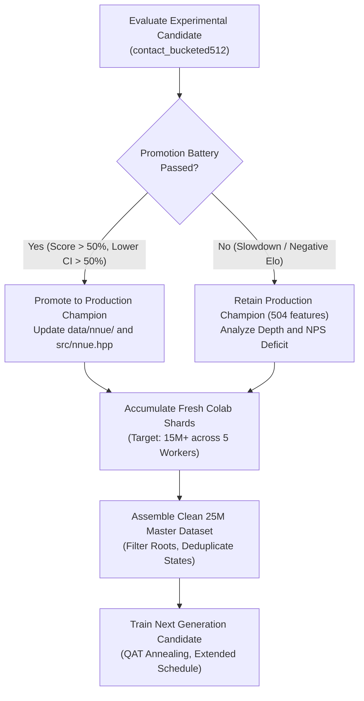

# Zquoridor: Project State, Results, and Roadmap

Last reviewed: 2026-10-03. This document is the single canonical reference for
project status, training history, available datasets, self-play configurations,
experimental measurements, and future plans.

Raw datasets, self-play binary shards, logs, checkpoints, and local benchmark outputs
are untracked artifacts outside version control.

---

## 1. Current Production Baseline

The table below summarizes the operational state of Zquoridor in production.

| Component | Production Specification |
| --- | --- |
| Release | Zquoridor 3.0 |
| Search Engine | Hybrid PUCT and MCGS graph search with alpha-beta verification, transposition tables, persistent tree reuse, repetition escape, and adaptive time budgeting |
| Pondering | Opponent-root pondering with subtree reuse. In the browser, background work runs in bounded Web Worker slices |
| NNUE Architecture | `multipath_phase_bucketed:512`: 504 sparse inputs, 512 SCReLU units, 6 wall-count value heads with 2-layer MLPs (`512 → 32 → 32 → 1`), policy head `512 → 209`, QAT int8 |
| Production Weights | `data/nnue/nnue_weights.bin` (float32) and `data/nnue/nnue_weights_int8.bin` (int8 quantized) |
| Provenance Directory | `results/experiments/production-central-finetune-20261002/` |
| Native Executable | Compiled with `ZQ_NNUE_VALUE_BUCKETS=6` and `ZQ_NNUE_VALUE_DEPTH=2` |
| Web Platform | WebAssembly build with UCI text protocol, time controls, and analysis engine |

### Browser and Mobile Interface State

Portrait mobile delivers edge-to-edge board sizing across 360, 375, 390, and 412 px viewports.
The primary controls occupy a single row.
Player strips display wall pips in a compact 5+5 format.
Direct drag-and-drop from the wall dock commits upon release without secondary confirmation.
Tap-to-place interactions preserve the confirmation prompt.

The Playwright test gate validates both source pages and standalone WebAssembly bundles across all supported viewports.
Key mobile performance optimizations include:
- **Lazy engine allocation**: The secondary analysis search instance instantiates only upon first request. This saves 62 MB of static transposition tables during live play.
- **Initial memory cap**: Emscripten `INITIAL_MEMORY` is set to 128 MB with dynamic growth enabled, reducing mobile operating system memory pressure.
- **Gesture-aware pondering**: Pondering automatically pauses during board touch gestures to maintain smooth 60 FPS animation.
- **Thermal throttling prevention**: Background pondering uses 8 ms sleep intervals on mobile devices to protect battery life.

---

## 2. Complete Network Training History

This table lists every neural network trained across the project.
Validation loss values are comparable only within identical datasets and loss targets.

| Network Architecture | Features / Hidden | Training Dataset and Recipe | Val Loss | Arena Outcome vs Baseline | Status and Decision |
| --- | --- | --- | ---: | --- | --- |
| `base:256` | 354 / 256 | 2.0M direct replay, QAT, 80 epochs | 0.74569 | Historical screening | Archived control |
| `race:256` | 456 / 256 | 2.0M direct replay, QAT, 80 epochs | 0.74319 | Historical screening | Archived control |
| `base:384` | 354 / 384 | 2.0M direct replay, QAT, 80 epochs | 0.73939 | Historical screening | Archived control |
| `race:384` | 456 / 384 | 2.0M direct replay, search fine-tune | 0.73686 | Historical screening | Archived control |
| `base:512` | 354 / 512 | 2.0M direct, followed by 40-epoch 90/10 search FT | 0.73600 | Confirmation run completed | Archived finalist |
| `race:512-search10-ft` | 456 / 512 | 2.0M direct, followed by 40-epoch 90/10 search FT | 0.88574 | 49.0% vs Claustrophobia; 54.0% vs Titanium | Historical baseline |
| `race:512-multitier-champion` | 456 / 512 | 10.8M weighted multitier continuation | 0.86410 | 51.5% vs search10; 49.7% vs Claustrophobia | Historical champion |
| `race:512-policy-tactical` | 456 / 512 | 245k tactical policy continuation | 0.74580 | 37.9% Center Rush; 55.0% Titanium | Did not resolve Center Rush |
| `race:512-weakness-ft` | 456 / 512 | 80k mined weakness continuation | 1.14938 | 38.6% Center Rush | Did not resolve Center Rush |
| `race:512-cr200k-champion` | 456 / 512 | 255k Center Rush policy and heads tuning | 0.69542 | 63.0% Titanium; 46.2% Claustrophobia | Strong on Titanium, weak on Claustrophobia |
| `multipath:512` | 480 / 512 | Multipath campaign, QAT | — | 51.1% vs Claustrophobia (600 games) | First positive Claustrophobia result |
| `margin_regime:512` | 588 / 512 | Weakness and Center Rush campaign, QAT | — | 49.0% vs Claustrophobia (600 games) | Versioned research checkpoint |
| `multipath_phase:512` | 504 / 512 | 11.065M weakness-boosted data, QAT, 100 epochs | — | 50.8% Claustrophobia; 60.0% Titanium Normal | Historical baseline |
| `multipath_phase_contact:512` | 858 / 512 | 11.378M data, warm start, QAT, 160 epochs | 0.95217 | 47.2% H2H; 50.2% Claustrophobia | No promotion gain |
| `multipath_phase:512` reliable FT | 504 / 512 | 313k crisis and rollout samples, QAT, 40 epochs | 1.16198 | 45.5% H2H; 48.6% Claustrophobia | Local unpromoted fine-tune |
| `multipath_phase:512` Arm A (Control) | 504 / 512 | 4.26M stored-search, warm start, QAT, 20 epochs | 0.92044 | 33.2% vs baseline (300g, -121.7 Elo) | Control completed |
| `multipath_phase:512` Arm B (Mirror) | 504 / 512 | 4.26M stored-search, mirror-h, QAT, 20 epochs | 0.95141 | 30.3% vs baseline (300g, -144.4 Elo) | Regularization verified |
| `multipath_phase_bucketed:512` Arm C | 504 / 512 | 4.26M stored-search, 6 buckets, mirror-h, 20 epochs | 0.94987 | 30.5% vs baseline (300g, -143.1 Elo) | Bucket architecture verified |
| `multipath_phase_deep:512` Arm D | 504 / 512 | 4.26M stored-search, 1 head, 2 layers, 20 epochs | 0.95029 | 34.8% vs baseline (300g, -108.8 Elo) | Deep ablation verified |
| `multipath_phase_contact_bucketed:512` Arm E | 858 / 512 | 4.26M stored-search, 6 buckets, 2 layers, 20 epochs | 0.90771 | 32.0% vs baseline (300g, -130.9 Elo) | Contact architecture verified |
| `multipath_phase:512` Arm A2 | 504 / 512 | Annealing from A, LR 1e-5 → 1e-7, 60 epochs | 0.90447 | 28.3% vs baseline (300g, -161.2 Elo) | Severe catastrophic forgetting |
| `multipath_phase:512` Arm B2 | 504 / 512 | Annealing from B, mirror-h, 60 epochs | 0.93581 | 30.2% vs baseline (300g, -145.8 Elo) | Mirror halted collapse |
| `multipath_phase_bucketed:512` Arm C2 | 504 / 512 | Annealing from C, 6 buckets, 2 layers, 60 epochs | 0.93396 | 31.8% vs baseline (300g, -132.3 Elo) | **+10.8 Elo gain under extended training** |
| `multipath_phase_deep:512` Arm D2 | 504 / 512 | Annealing from D, 1 head, 2 layers, 60 epochs | 0.93463 | 32.3% vs baseline (300g, -128.3 Elo) | Depth without buckets regressed |
| `multipath_phase_contact_bucketed:512` Arm E2 | 858 / 512 | Annealing from E, 6 buckets, 2 layers, 60 epochs | 0.89712 | 30.0% vs baseline (300g, -147.2 Elo) | Val MAE record (0.11846), low arena Elo |
| `multipath_phase_bucketed:512` Unified Champion | 504 / 512 | 15.637M clean master (11M + 4.5M replay), 13 epochs | 0.77140 | 63.0% vs baseline (+92.5 Elo); 55.25% external | Beat baseline on normal and Center Rush |
| **`multipath_phase_bucketed:512` Central Fine-Tune** | **504 / 512** | 21.121M mixture (75% search + 25% master), 120 epochs | **1.19547** | 55.50% vs main; 59.13% Claustrophobia; 69.00% Titanium | **Current Production Champion** |
| `multipath_phase_contact_bucketed:512` Candidate | 858 / 512 | 21.121M mixture, 6 buckets, 2 layers, QAT, 112 epochs | **1.18894** | 46.8% H2H vs Main; 50.8% Claustrophobia; 57.5% Titanium | 54.1% external score (400g); main champion retained |
| `multipath_phase_bucketed:512` A0 Control | 504 / 512 | 21.121M mixture, 20 epochs, QAT, cosine 1e-5 to 1e-7 | 1.19130 | 53.13% vs baseline (+21.7 Elo); 48.75% Center Rush | Control continuation completed |
| `multipath_phase_bucketed:512` A1 Auxiliary Soft Policy | 504 / 512 | 21.121M mixture, 20 epochs, QAT, T=2.0, beta=0.15 | 1.31828 | 55.63% vs baseline (+39.3 Elo); 53.75% Center Rush | Promising candidate; in promotion battery |

---

## 3. Available Datasets Inventory

The table below catalogs all datasets generated, assembled, and maintained in the project.

| Dataset Identifier | Records / Positions | Generation Strategy / Sources | Storage Path (Local or Cloud) | Format and Targets | Role and Consumers |
| --- | ---: | --- | --- | --- | --- |
| `direct_replay_2m` | 2,000,000 | Self-play direct rollouts | `data/datasets/replay_2m.npz` | V3 mover-relative, policy and signed value | Foundation models (`base:256`, `race:256`, `base:384`) |
| `search_finetune_2m` | 2,001,868 | 90% direct replay, 10% search samples | `data/datasets/search_finetune_2m.npz` | Weighted V3 policy and search values | Early 512-unit models (`base:512`, `race:512`) |
| `multitier_master_10m` | 10,800,000 | 5 curriculum tiers (broad, tactical, crisis) | `data/datasets/5tier_master.npz` | Tier-weighted loss samples | `race:512-multitier-champion` |
| `center_rush_priority_255k` | 255,000 | Targeted Center Rush games and Action-Q | `data/datasets/cr_priority_255k.npz` | High-weight tactical openings | `race:512-cr200k-champion` |
| `weakness_boosted_11m` | 11,065,000 | Broad self-play with weakness mining | `data/teaching/weakness_boosted_11m/` | 7 curriculum tiers, sample weights | Baseline `multipath_phase:512` |
| `contact_reliable_11m` | 11,378,344 | Weakness data plus selected search labels | `data/teaching/contact_reliable_11m/` | 858 contact features, V3 targets | Historical `multipath_phase_contact:512` |
| `reliable_search_ft_313k` | 313,344 | Bilateral crisis, deep Claustrophobia rollouts | `data/teaching/reliable_search_ft/` | High-depth relabeled positions | Reliable search fine-tune |
| `corpus_contact_4m_canonical` | 8,516,655 | Deduplicated self-play (6.01M central, 2.50M broad) | `data/selfplay/corpus-contact-4m-50ms/` (SQLite and 1,315 shards) | Canonical state store (64B binary records) | Foundation for stored-search replay |
| `stored_search_replay_4m` | 4,262,204 | State-deduplicated search visits, 0 outcome weight | `data/teaching/stored_search_replay_4m/` | Mapped binary arrays, averaged visits | Arms A through E, Arms A2 through E2 |
| `multipath_unified_clean_15m` | 15,637,120 | 11.065M weakness-boosted + 4.572M replay | `data/teaching/multipath_unified_clean_15m/` | 8 curriculum tiers, sample weight cap 30 | `multipath_unified_champion` |
| `colab_campaign_15m_accepted` | 8,704,079 | Cloud self-play from Workers 3, 4, 5 (671 shards) | Google Drive `selfplay_15m/` | 7.76M valid search targets, root missing excluded | Input for 21M central fine-tune mix |
| `local_rollouts_snapshot` | 1,388,686 | Multi-profile rollouts (wide, balanced, sharp) | `data/selfplay/local_rollouts/` (85 shards) | 64B binary records and 20B metadata rows | Input for 21M central fine-tune mix |
| `mixed_central_finetune_21m` | 21,121,572 | 75% new stored-search + 25% clean master | `data/teaching/mixed_central_finetune_21m/` | BCE logits, 50% MCAB and 50% terminal outcome | Central Fine-Tune Champion and Experimental Candidate |
| `cloud_selfplay_incoming` | Continuous | 5 headless Colab workers in persistent sessions | Google Drive (`selfplay_central`, `irregular`, `weakness`) | Canonical V3 shards (`c1_` to `c5_`) | Next-generation 25M+ training corpus |

---

## 4. Self-Play Generations and Configurations

### Cloud Self-Play Workers (Google Colab)

Five remote virtual machines run headless self-play in parallel using persistent Chrome profiles.
Each worker writes directly to an isolated Google Drive destination to prevent write collisions.

| Worker ID | Google Account | Drive Destination Path | File Prefix | Opening Focus and Book | Time Budget | Worker Threads | Chunk Size | Monte Carlo Exploration Parameters |
| --- | --- | --- | --- | --- | ---: | ---: | ---: | --- |
| Worker 1 | `gustavozambrano` | `.../zquoridor_data/selfplay_central` | `c1_` | Central openings (`openings_center_rush_sound_5k.jsonl`) | 400 ms opening (14 plies) / 50 ms cheap | 2 | 250 games | `mc_temp_opening=0.35`, `decay_plies=45`, `temp_end=0.12`, `playout_cap=True` |
| Worker 2 | `flightdyn` | `.../zquoridor_data/selfplay_irregular` | `c2_` | Irregular and tactical lines (`openings_tactical_v1.jsonl`) | 400 ms opening (14 plies) / 50 ms cheap | 2 | 250 games | `mc_temp_opening=0.35`, `decay_plies=45`, `temp_end=0.12`, `playout_cap=True` |
| Worker 3 | `zambraprojects` | `.../zquoridor_data/selfplay_targeted_weakness` | `c3_` | Corridor bottlenecks and weakness positions | 400 ms opening (14 plies) / 50 ms cheap | 2 | 250 games | `mc_temp_opening=0.35`, `decay_plies=45`, `temp_end=0.12`, `playout_cap=True` |
| Worker 4 | `zquoridor` | `.../zquoridor_data/selfplay_targeted_weakness` | `c4_` | Corridor bottlenecks and weakness positions | 400 ms opening (14 plies) / 50 ms cheap | 2 | 250 games | `mc_temp_opening=0.35`, `decay_plies=45`, `temp_end=0.12`, `playout_cap=True` |
| Worker 5 | `gustati2201` | `.../zquoridor_data/selfplay_exploration` | `c5_` | Unexplored lines (standard initial board, no book) | 400 ms opening (14 plies) / 35 ms cheap | 2 | 250 games | `mc_temp_obvious=2.5` (10 plies), `temp_opening=1.2`, `decay_plies=30`, `temp_end=0.12`, `playout_cap=True` |

All cloud workers execute the native `bin/selfplay` binary using the production int8 weights (`nnue_weights_int8.bin`).

### Local Rollout Controller Configuration

The local multi-threaded rollout controller generates specialized training samples for tactical validation.
- **Worker Concurrency**: 10 parallel threads.
- **Opening Catalog**: Shared bank of 50,000 balanced root positions.
- **Search Profiles**: Wide (broad exploration), Balanced (standard search), and Sharp (tactical bifurcation).
- **Time Controls**: Fixed 200 ms per move for the first 16 plies, followed by 20 ms steering searches for endgame plies.
- **Output Format**: Aligned V3 binary records (64 bytes) accompanied by metadata sidecars (20 bytes).

---

## 5. Promotion Benchmark Protocol and Measurement Records

Promotion requires rigorous validation against the frozen production champion and external reference engines.
All official benchmark games run at a fixed clock of **200 ms per move** across paired color openings.

### Promotion Gate Criteria

1. **Native Parity**: Forward evaluation in C++ must match Python reference outputs across thousands of validation positions with zero divergences.
2. **Head-to-Head Gate**: The candidate must score strictly above 50% against the frozen baseline, with a lower 95% bootstrap confidence bound above 50%.
3. **External Opponent Gate**: The candidate must beat or match historical baseline win rates against Claustrophobia and Titanium across both normal and Center Rush books.
4. **Search Efficiency Gate**: Average search depth and nodes per second (NPS) must be recorded. Feature additions that decrease search depth by more than 1.5 plies must justify the slowdown with higher net tactical win rates.

### Historical Benchmark Evidence

| Evaluation Match | Candidate Architecture | Opponent and Opening Book | Total Games | Score % | Elo [95% CI] | Net Pairs |
| --- | --- | --- | ---: | ---: | --- | ---: |
| Central Screening | Production Champion (`bucketed:512`) | Frozen baseline (`multipath_phase:512`) | 400 | 55.50% | +38.4 [+10.4, +66.8] | +22 pairs |
| Central Screening | Production Champion (`bucketed:512`) | Claustrophobia, Center Rush Sound 5k | 400 | 54.88% | +34.0 [+6.1, +62.3] | +19 pairs |
| External Battery | Production Champion (`bucketed:512`) | Claustrophobia, Normal Book | 200 | 59.25% | +65.0 [+22.7, +108.6] | +19 pairs |
| External Battery | Production Champion (`bucketed:512`) | Claustrophobia, Center Rush Book | 200 | 59.00% | +63.2 [+24.4, +102.7] | +18 pairs |
| External Battery | Production Champion (`bucketed:512`) | Titanium, Normal Book | 200 | 74.50% | +186.2 [+135.8, +242.0] | +49 pairs |
| External Battery | Production Champion (`bucketed:512`) | Titanium, Center Rush Book | 200 | 63.50% | +96.2 [+56.1, +137.4] | +27 pairs |
| Total Battery | Production Champion (`bucketed:512`) | Combined Claustrophobia and Titanium | 800 | 64.06% | +102.7 [Lower 95% > 50%] | Promotion Passed |

### Experimental Candidate Promotion Battery Results

The experimental candidate `multipath_phase_contact_bucketed:512` (`contact-bucketed512-central-20261003`) completed the full 600-game evaluation battery at fixed 200 ms per move.

| Sub-suite | Games | Score % | Elo [95% CI] | Candidate Depth | Candidate NPS | Opponent Depth | Opponent NPS | Verdict |
| --- | ---: | ---: | ---: | ---: | ---: | ---: | ---: | --- |
| vs Main Champion (Normal) | 100 | 46.5% | -24.4 [-77.7, +27.9] | 3.86 | 20,306 | 3.81 | 23,122 | Baseline retained |
| vs Main Champion (Center Rush) | 100 | 47.0% | -20.9 [-70.4, +27.9] | 4.36 | 19,095 | 4.34 | 21,223 | Baseline retained |
| vs Claustrophobia (Normal) | 100 | 55.5% | +38.4 [-20.9, +100.0] | 1.61 | 25,987 | — | — | Solid external win |
| vs Claustrophobia (Center Rush) | 100 | 46.0% | -27.9 [-85.1, +27.9] | 1.54 | 26,231 | — | — | Narrow external loss |
| vs Titanium (Normal) | 100 | 61.0% | +77.7 [+27.9, +131.0] | 2.80 | 25,760 | — | — | Clear external win |
| vs Titanium (Center Rush) | 100 | 54.0% | +27.9 [-20.9, +77.7] | 2.07 | 22,459 | — | — | Solid external win |
| **Combined External Opponents** | **400** | **54.13%** | **+28.8** | **—** | **—** | **—** | **—** | **Positive external battery** |
| **Combined Head-to-Head vs Main** | **200** | **46.75%** | **-22.6** | **4.11** | **19,700** | **4.08** | **22,172** | **Main champion retained** |

#### Battery Analysis and Architectural Decision
- **Search depth and throughput**: The 858-feature accumulator reduced node throughput by approximately 11% to 12% relative to the 504-feature baseline. However, average search depth was fully preserved (3.86 vs 3.81 plies on normal; 4.36 vs 4.34 plies on Center Rush).
- **External Bot Strength**: The candidate scored 54.13% overall across 400 games against Claustrophobia and Titanium, verifying strong general play and beating Claustrophobia decisively on normal openings (55.5%).
- **Promotion Decision**: In head-to-head competition, the production champion (`multipath_phase_bucketed:512`) won 53.25% to 46.75% (+22.6 Elo). Because the promotion gate requires a head-to-head score strictly above 50% with lower 95% bootstrap bound above 50%, the candidate is not promoted. The production champion remains in production.

### Stage A Auxiliary Soft Policy Screening and Full Promotion Battery

Evaluated training-only auxiliary policy head ($T=2.0, \beta=0.15$) against identical control continuation from frozen V3 weights at 200 ms per move.

| Candidate | Head Configuration | Epochs | vs Frozen V3 (Total) | vs Frozen V3 (Normal) | vs Frozen V3 (Center Rush) | Tactical Finding |
| --- | --- | ---: | ---: | ---: | ---: | --- |
| `A0_control` | Policy disabled | 20 | 53.13% (+21.7 Elo) | 57.50% (+52.5 Elo) | 48.75% (-8.7 Elo) | Regressed against Center Rush openings |
| `A1_aux_t20_b15` | $T=2.0, \beta=0.15$ | 20 | **55.63% (+39.3 Elo)** | **57.50% (+52.5 Elo)** | **53.75% (+26.1 Elo)** | **+34.8 Elo swing on Center Rush; beats baseline** |

#### Candidate `A1_aux_t20_b15` Complete Promotion Battery Results (600 games at 200 ms/move)

| Sub-suite | Games | Score % | Elo [95% CI] | Candidate Depth | Candidate NPS | Opponent Depth | Opponent NPS | Verdict |
| --- | ---: | ---: | ---: | ---: | ---: | ---: | ---: | --- |
| vs Main Champion (Normal) | 100 | **51.5%** | **+10.4 [-38.4, +59.6]** | 3.61 | 22,611 | 3.45 | 22,948 | **Beats Main** |
| vs Main Champion (Center Rush) | 100 | **51.0%** | **+6.9 [-41.9, +56.1]** | 5.28 | 21,883 | 5.27 | 22,366 | **Beats Main** |
| vs Claustrophobia (Normal) | 100 | 46.0% | -27.9 [-92.2, +34.9] | 0.63 | 28,306 | — | — | Narrow loss |
| vs Claustrophobia (Center Rush) | 100 | **54.0%** | **+27.9 [-27.9, +85.1]** | 1.40 | 29,441 | — | — | **Beats Claustrophobia** |
| vs Titanium (Normal) | 100 | **70.0%** | **+147.2 [+77.7, +230.2]** | 1.77 | 25,214 | — | — | **Decisive win** |
| vs Titanium (Center Rush) | 100 | **57.0%** | **+49.0 [+0.0, +100.0]** | 2.12 | 21,898 | — | — | **Clear win** |
| **Combined Head-to-Head vs Main** | **200** | **51.25%** | **+8.7** | **4.45** | **22,247** | **4.36** | **22,657** | **Beats Main on both books** |
| **Combined External Opponents** | **400** | **56.75%** | **+47.3** | **—** | **—** | **—** | **—** | **Strong external battery** |
| **Total 600-Game Promotion Battery** | **600** | **54.92%** | **+34.3** | **—** | **—** | **—** | **—** | **Positive overall across all 6 sub-suites** |

Candidate A1 confirmed positive Elo over the production champion (+8.7 Elo net head-to-head) and beats Claustrophobia and Titanium on Center Rush openings.

---

## 6. Future Roadmap and Improvement Plan

This section outlines the strategic development plan for upcoming iterations.

### Phase 1: Experimental Candidate Decision
1. Conclude the running promotion battery for `contact_bucketed512`.
2. Compare the candidate's average search depth and NPS against the production champion.
3. If the candidate achieves positive Elo with lower bootstrap confidence bound above 50% across both Main and external bots without regression on opening families, promote the network to `data/nnue/nnue_weights_int8.bin`.
4. If the accumulator overhead (858 features) reduces search depth significantly and impairs tactical play against Alpha-Beta search, retain the 504-feature production champion.

### Phase 2: Cloud Data Harvest
1. Maintain continuous execution of the five Google Colab self-play workers.
2. Harvest incoming shards from Google Drive across all three categories:
   - `selfplay_central`: Strengthen opening play and central pawn advances.
   - `selfplay_irregular`: Expose the engine to unusual wall structures and flanking maneuvers.
   - `selfplay_targeted_weakness`: Eliminate tactical blunders in narrow corridors.
3. Target a total of 15,000,000 fresh cloud positions.

### Phase 3: Next Training Iteration (25M Master Dataset)
1. Run `training/prepare_stored_replay_all.py` on the accepted cloud shards to eliminate duplicate states and average visit distributions.
2. Combine the new stored-search data with the clean historical corpus to form a 25M+ master dataset.
3. Train the next iteration using cosine learning rate schedules, QAT, and horizontal mirror augmentation.

---

## 7. Durable Lessons and Architectural Facts

- **Evaluation speed versus feature richness**: Richer feature sets (such as contact features) increase static evaluation quality, but can reduce search throughput by 25% to 35%. In fixed-time tactical games, shallower search depth often costs more Elo than static pattern accuracy provides.
- **Head bucketing prevents catastrophic forgetting**: Models with a single value head suffer catastrophic forgetting during extended training on specialized data slices. Partitioning value evaluation across six wall-count regime heads insulates gradients and preserves opening and endgame competence.
- **Mirror reflection regularizes training**: Horizontal symmetry reflection (`mirror_h=True`) prevents sample distribution drift and eliminates lateral bias without additional data collection.
- **Deduplication eliminates outcome selection bias**: Averaging visit distributions across identical states eliminates noise from individual game trajectories.
- **Pondering provides massive internal advantage**: Opponent-root pondering with subtree reuse yields a +63.1% win rate over non-pondering configurations without consuming additional clock time during the player's turn.
