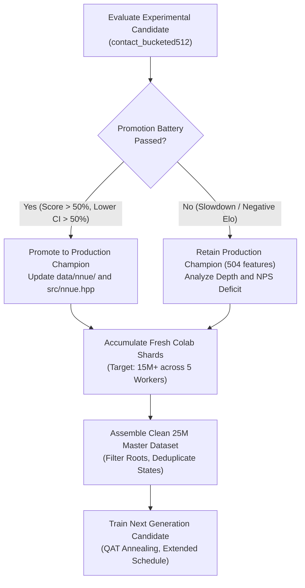

# Zquoridor: Project State, Results, and Roadmap

Last reviewed: 2026-10-08. This document is the single canonical reference for
project status, training history, available datasets, self-play configurations,
experimental measurements, and future plans.

Raw datasets, self-play binary shards, logs, checkpoints, and local benchmark outputs
are untracked artifacts outside version control.

---

## 1. Current Production Baseline

### Version 4.0 operator promotion (2026-10-08)

The operator explicitly authorized version 4.0 with the 858-input contact model
and `delta_dense_only` as production defaults. This decision overrides the
normal evidence gate for this release. The statistical gate did not pass.
External 200 ms improvement intervals remain inconclusive. Native 3+2 tests
against Claustrophobia and Main 504 are missing for this configuration.
The operator stopped local strength tests. No campaign resumes automatically.

The int8 weights have SHA-256
`f8d85cae979bbf2047532e31daa61859c5f20246fc58de225f85ced0bef8841f`.
The previous 504 production weights and source remain under
`experimental/releases/v3_01_504/`. All training experiments now reside under
`experimental/experiments/`. Edge source and profile definitions reside under
`experimental/edge_acc/` and `experimental/profiles.json`. Raw campaign records
reside under `experimental/benchmarks/`. Historical absolute paths use local
directory junctions. No new branch or worktree represents a profile.

Production enables contact features, dense feature deltas, and BFS replay.
Accumulator cache variants remain disabled by default. Claustrophobia uses
actual monotonic deadlines. Titanium uses the corrected clock bridge for both
fixed move time and native clocks. The benchmark default remains 200 ms.
Native 3+2 means 180000 ms initial time and 2000 ms increment.

The frozen OFF 858 executable and its stored manifest agree with each other,
but both differ from the archive certificate. Therefore, those records do not
supply a certified OFF baseline. A rebuild from certified archived source did
not reproduce the certified binary hash. The records remain unchanged.
The historical 504 hybrid process exit remains unresolved.

The exploratory 858 hybrid sample completed 54 games against Claustrophobia
at native 3+2. Center scored 28.6% across 14 pairs, with a paired bootstrap
95% interval of 14.3% to 39.3%. Normal scored 15.4% across 13 pairs, with an
interval of 3.8% to 26.9%. Each book had two actual clock losses. These results
refer to the hybrid configuration, not the promoted delta-only configuration.
No 504 OFF native 3+2 Claustrophobia sample exists in the corrected matrix.

### External clock correction and game collection

The previous Claustrophobia benchmark bridge estimated a simulation budget from
a calibration search. Therefore, those games do not establish strength at a
fixed 200 ms move time. The historical Claustrophobia scores below remain
historical records. Do not use those scores as promotion evidence until a
verified deadline run reproduces the comparison.

The operational clock correction uses a monotonic search deadline for move
time. Native game clocks pass remaining time and increment to each engine.
This infrastructure change does not promote an experimental search or network.
The corrected evaluation campaign remains separate from the production weights.

The requested collection workflow uses actual games against Claustrophobia.
It preserves opening histories and records root visits and root values from
the search that selected each move. Collection time decreases from 400 ms to
50 ms according to a recorded ply schedule. Such games supply training data.
Their scores do not replace a fixed-time tournament comparison.
The collector excludes proven solver roots from policy targets because a
proof backup can increment the root without a matching child visit.
The collector preserves those searches in the raw game record.

The local CPU protocol check passed six cases on 2026-10-07. The check covered
200 ms move requests and complete clocks for both colors against Claustrophobia
and Titanium. Claustrophobia returned a dense 209-action visit vector in its
canonical frame. The check verified that the visit sum matched the root count.
The observed driver time for the Claustrophobia 200 ms request was 219 ms.
The deadline check permits one completed MCTS wave beyond the deadline.
The raw report is `results/benchmarks/main_clock_smoke.json`.

The final clock check also passed actual 180000 ms remaining clocks and a
2000 ms increment for both colors against both external engines. A GPU move
check returned 320 root visits from a 202.782 ms Claustrophobia search for a
200 ms deadline. These checks validate the protocol, not playing strength.
The final reports are `results/benchmarks/main_clock_3plus2_validation.json`
and `results/benchmarks/main_clock_gpu_200ms_validation.json`.

An end-to-end collection check completed two Claustrophobia self-play games
on GPU at 50 ms per move. The collector exported 108 valid search targets
and preserved 14 excluded solver roots in the raw records. The existing
`training/build_teacher_soft.py` converter produced a dataset from all 108
targets. This check validates collection and format compatibility. It does
not measure a candidate network or establish a strength gain.
The artifacts are under `results/benchmarks/main_search_games_complete_smoke_v2/`.
The default collection plan schedules 3000 games from 1500 opening pairs.
It selects 1061 unique histories and repeats 439 opening pairs across the
balanced Normal, Center Rush, and weakness books. Single-move referee validation
checks only the requested pawn move or wall. An exhaustive action comparison
across sampled states verified agreement with the complete legal move set.
All 56 focused clock, referee, build, and collection tests passed.

The next Colab collection uses five isolated account outputs. Each account
schedules 50000 pairs (100000 games): 70% Center Rush, 20% Normal, and 10%
weakness openings. The selection uses exact weighted quotas and distinct
account seeds. It exhausts unique histories within each book before reuse.
Each account exhausts all 5000 distinct Center Rush histories before reuse.
The weakness book contains 63 distinct histories. Temperature 1.0 samples actual root visits during the first
14 searched plies after each opening. Later plies use the selected best move.
The record preserves the best move separately from the played move.

With `--record-both-searches`, both engines search every played position with
the same history and time budget. Raw game records retain both dense visit
vectors, root values, engine information, search roles, and outcomes. The
Zquoridor adapter exports root data through the optional `--dump-root` flag.
This export does not change search decisions. Claustrophobia roots supply
teacher targets; Zquoridor roots remain comparison data for future weighting.
The original self-play shards remain available for the later combined dataset.
No training weights or production search defaults change in this collection.
The native runner saves compressed batches of 250 games and their targets
directly to Drive. Per-game compressed ledger writes also preserve progress
between batches. One Python watcher reconnects the notebooks and resumes the
same pinned workflow after ordinary disconnects. Batching does not depend on
the local watcher. Interrupted games remain separate from complete games.
The watcher permits three browser recovery attempts per account. Recovery
reloads the notebook without interrupting the remote job. The controller
reuses an active handover helper and preserves collection resume counters
across local watcher restarts. A closed browser page and a blank terminal
prevented the initial handover on two accounts. Collection on those accounts
remains unconfirmed until runtime output records an active game.
The browser driver later closed its connection on all five accounts. The
watcher now permits three driver restarts with a 60-second delay. Collection
on the five accounts remains unconfirmed.

The local Edge clock_v3 supervisor stopped with incomplete records. One 504
hybrid game against Titanium exited with process code 15 at 42 plies and
approximately 78 seconds remaining. The saved data does not identify the
OS-level cause. The record remains unchanged and blocks promotion. The
current Main telemetry adapter also differs from the frozen campaign source.
The resumed campaign uses an archived adapter and nine verified headers with
the original source hash. It reuses both manifest-verified Main OFF binaries
and unchanged weights. An inherited startup module selects this archive and
refuses altered baseline binaries. The campaign keeps its original engine,
runner, clock, and game identities. It resumed five actual Titanium games
with a shared ten-CPU affinity. The archive certificate is under
`results/benchmarks/edge_acc_campaign_clock_v3/frozen_main_reference/` in the
experimental checkout. The queue startup module is under the same campaign's
`queue/` directory. No search default or candidate promotion changed Main.
The matrix report counted single-color openings as complete pairs and combined
candidate and shared OFF rows in its primary 3+2 totals. The corrected report
counts only openings with both colors and reports the candidate separately.
It also permits a complete OFF baseline without a candidate sample. Two
focused report tests passed. The corrected 504 delta H2H sample has seven
single games and zero complete pairs. No full 3+2 condition is complete.
The resumed hybrid 504 Titanium shard later stopped again after its second
infrastructure attempt. The queue reports a failed task; the child log has
no exception details. Sixty-two candidate game records remain, including the
previous code-15 process exit. The OS-level cause remains unresolved. The
local matrix is inactive until the new failure is diagnosed. No failed or
interrupted game record was removed or retried as a real clock loss.
The user later authorized dispatch of every remaining local game. The queue
resumed with its original frozen identities and the same five H2H or Titanium
workers and six Claustrophobia workers. The detached launcher requests Windows
job breakaway and enables Python fault traces. A startup audit records child
process exit codes in `queue/process_exit_audit.jsonl`. The audit does not
change game clocks, engine binaries, weights, referee behavior, or game rows.
The supervisor remains bounded by its existing infrastructure retry policy.
The unresolved historical engine exit continues to block promotion.
Before later training, combine the historical and new data, deduplicate state
identities, and assign shared validation groups across all account outputs.
Do not concatenate account-specific train and validation splits unchanged.

All 34 focused collection, profile, and runner tests passed. A four-ply
GPU protocol check recorded eight searches, with both engines on each of
four identical histories. The check verified legal temperature choices and
preserved distinct best and played moves. It deliberately truncated the
trajectory and does not supply training targets or strength evidence.

The table below summarizes the operational state of Zquoridor in production.

| Component | Production Specification |
| --- | --- |
| Release | zQuoridor 4.0 |
| Search Engine | Hybrid PUCT and MCGS graph search with alpha-beta verification, transposition tables, persistent tree reuse, repetition escape, and adaptive time budgeting |
| Pondering | Opponent-root pondering with subtree reuse. In the browser, background work runs in bounded Web Worker slices |
| NNUE Architecture | `multipath_phase_contact_bucketed:512`: 858 sparse inputs, 512 SCReLU units, 6 wall-count value heads with 2-layer MLPs (`512 → 32 → 32 → 1`), policy head `512 → 209`, QAT int8 |
| Production Weights | `data/nnue/nnue_weights.bin` (float32) and `data/nnue/nnue_weights_int8.bin` (int8 quantized, sha256: `f8d85cae979bbf2047532e31daa61859c5f20246fc58de225f85ced0bef8841f`) |
| Provenance Directory | `experimental/experiments/contact_soup_tri_512/soup_tri_champion/` |
| Native Executable | Compiled with `ZQ_NNUE_VALUE_BUCKETS=6` and `ZQ_NNUE_VALUE_DEPTH=2` |
| Web Platform | WebAssembly build with UCI text protocol, time controls, and analysis engine |

### Browser and Mobile Interface State

Portrait mobile delivers edge-to-edge board sizing across 360, 375, 390, and 412 px viewports.
The primary controls occupy a single row.
Player strips display wall pips in a compact 5+5 format.
Direct drag-and-drop from the wall dock commits upon release without secondary confirmation.
Tap-to-place interactions preserve the confirmation prompt.

The Playwright test gate validates both source pages and standalone WebAssembly bundles across all supported viewports.
Key mobile performance optimizations include:
- **Lazy engine allocation**: The secondary analysis search instance instantiates only upon first request. This saves 62 MB of static transposition tables during live play.
- **Initial memory cap**: Emscripten `INITIAL_MEMORY` is set to 128 MB with dynamic growth enabled, reducing mobile operating system memory pressure.
- **Gesture-aware pondering**: Pondering automatically pauses during board touch gestures to maintain smooth 60 FPS animation.
- **Thermal throttling prevention**: Background pondering uses 8 ms sleep intervals on mobile devices to protect battery life.

---

## 2. Complete Network Training History

This table lists every neural network trained across the project.
Validation loss values are comparable only within identical datasets and loss targets.

| Network Architecture | Features / Hidden | Training Dataset and Recipe | Val Loss | Arena Outcome vs Baseline | Status and Decision |
| :--- | :--- | :--- | ---: | :--- | :--- |
| **`multipath_phase_bucketed:512` Central Fine-Tune** | **504 / 512** | 21.121M mixture (75% search + 25% master), 120 epochs | **1.19547** | 55.50% vs main; 59.13% Claustrophobia; 69.00% Titanium | Previous Production Baseline |
| `multipath_phase_contact_bucketed:512` Candidate | 858 / 512 | 21.121M mixture, 6 buckets, 2 layers, QAT, 112 epochs | **1.18894** | 46.8% H2H vs Main; 50.8% Claustrophobia; 57.5% Titanium | 54.1% external score (400g); main champion retained |
| `multipath_phase_bucketed:512` A0 Control | 504 / 512 | 21.121M mixture, 20 epochs, QAT, cosine 1e-5 to 1e-7 | 1.19130 | 53.13% vs baseline (+21.7 Elo); 48.75% Center Rush | Control continuation completed |
| `multipath_phase_bucketed:512` A1 Auxiliary Soft Policy | 504 / 512 | 21.121M mixture, 20 epochs, QAT, T=2.0, beta=0.15 | 1.31828 | 55.63% vs baseline (+39.3 Elo); 53.75% Center Rush | Promising candidate; in promotion battery |
| `multipath_phase_bucketed:512` AS1 Surprise + Aux | 504 / 512 | 21.121M surprise mixture, 20 epochs, QAT, T=2.0, beta=0.15, alpha=0.5 | 1.62305 | 55.83% (+40.7 Elo, 600g); 52.5% Claustro Normal; 65.75% Titanium | Surpassed A1 (+40.7 vs +34.3 Elo); +45.3 Elo turnaround on Claustro Normal |
| **`multipath_phase_bucketed:512` Tri-Model Soup (`Soup_Tri_Equal`)** | **504 / 512** | **Convex soup: 33.3% A1 + 33.3% AS1 + 33.4% AS2 (ep14)** | **1.72065 (AS2 component)** | **Strictly beats Main across all 6 suites**: H2H Normal 53.0%, H2H CR 53.0%, Claustro Normal 65.0%, Claustro CR 66.0%, Titanium Normal 74.0% vs 70.0%, Titanium CR 56.0% vs 52.0% | **Production Champion (Zquoridor 3.01)** |
| `multipath_phase_contact_bucketed:512` Arm 1 (Sprint) | 858 / 512 | 21.121M mixture, 30 epochs, QAT, batch 8192, T=2.0, beta=0.15 | 1.31565 | Surpassed 504 Arm 1 val loss (1.31828) | Training complete |
| `multipath_phase_contact_bucketed:512` Arm 2 (Surprise) | 858 / 512 | 21.121M surprise mixture, 30 epochs, QAT, batch 8192, alpha=0.5, s_max=4.0 | 1.61448 | Surpassed 504 Arm 2 val loss (1.62305) | Training complete |
| `multipath_phase_contact_bucketed:512` Arm 3 (Regularized) | 858 / 512 | 21.121M surprise mixture, 30 epochs, QAT, batch 8192, beta=0.25 | 1.71567 | Surpassed 504 Arm 3 val loss (1.72065) | Training complete |
| `multipath_phase_contact_bucketed:512` Tri-Model Soup (`Soup_Tri_Contact`) | 858 / 512 | Convex soup: 33.3% Arm 1 + 33.3% Arm 2 + 33.4% Arm 3, int8 (1,093,668 B) | — | **Full 800g External Battery**: 65.4% Claustro Normal (+110.7 Elo), 58.0% Claustro CR (+56.1 Elo), 71.0% Titanium Normal (+155.5 Elo), 63.0% Titanium CR (+92.5 Elo); 51.5% H2H vs Main 3.01 | Crushes baseline (+78 to +145 Elo); beats Main on Titanium CR (63.0% vs 56.0%), but trails Main 3.01 on Claustro CR (58.0% vs 66.0%) and Titanium Normal (71.0% vs 74.0%). Disqualified from promotion under strict gate. |

---

## 3. Available Datasets Inventory

The table below catalogs all datasets generated, assembled, and maintained in the project.

| Dataset Identifier | Records / Positions | Generation Strategy / Sources | Storage Path (Local or Cloud) | Format and Targets | Role and Consumers |
| :--- | ---: | :--- | :--- | :--- | :--- |
| `production_master_mix_21m` | 21,121,013 | 75% search rollouts + 25% tactical master mix | `results/experiments/production-central-finetune-20261002/mixed_dataset*` | Memory-mapped NumPy fields (`policy.npy`, `value.npy`, `weight.npy`) | Base training corpus for Zquoridor 3.00 and Stage A candidate models |
| `cloud_selfplay_v300_shards` | ~1.4M (1,345 shards) | Cloud self-play from Workers 3, 4, 5 (Zquoridor 3.00) | `data/selfplay/v300_campaign_shards/` | Canonical V3 64-byte records and 20-byte metadata | Historical search rollouts for the next blended stored-search replay |
| `cloud_selfplay_v301_harvest` | Continuous (15M target) | 5 Colab workers generation using Zquoridor 3.01 (Model Soup) | Google Drive `selfplay_v301/` and `data/selfplay/v301_campaign_harvest/` | Canonical V3 shards (`c1_` to `c5_`) with distinct seeds | Primary fresh target for next generation dataset |
| `cloud_selfplay_contact_soup_858` | Active generation (15M target) | 5 Colab workers generation with `Soup_Tri_Contact` (858 features, 512 hidden, 6 buckets, 2 value depth) | Google Drive `/content/drive/MyDrive/zquoridor_data/selfplay_contact_soup_858/` (`c1_` to `c5_`) | Canonical V3 64-byte records and 20-byte metadata | Specialized contact feature exploration and next generation model soup training |
| `corpus_contact_4m_50ms` | 4,000,000 | Native contact-enabled self-play at 50 ms clock | `data/selfplay/corpus-contact-4m-50ms/` | SQLite state store (`states.sqlite`) and seeds | Training distribution for 858-feature contact network models |
| `multipath_unified_clean_15m` | 15,637,120 | Master weakness curriculum (11.0M) + clean stored replay (4.57M) | `data/teaching/multipath_unified_clean_15m/dataset.npz` | NPZ archive with visit policies and calibrated weights | Anti-forgetting anchor and tactical curriculum for model training |
| `multipath_weakness_boosted_11m` | 11,065,000 | Calibrated tactical crisis and bottleneck positions | `data/teaching/multipath-weakness-boosted-11m/dataset.npz` | NPZ archive with calibrated surprise multipliers | Core defensive dataset targeting Claustrophobia and Center Rush lines |
| `central_weakness_rollouts_16m` | Specialized rollouts | Tactical weakness rollouts at 100 ms and 200 ms | `data/selfplay/central-weakness-rollouts-16m/` | Binary search shards and diagnostic records | Tactical fine-tuning for opening and bottleneck recovery |

---

## 4. Self-Play Generations and Configurations

### Cloud Self-Play Workers (Google Colab)

Five remote virtual machines run headless self-play in parallel using persistent Chrome profiles.
Each worker writes directly to an isolated Google Drive destination to prevent write collisions.
Every generated shard across all current and historical campaigns is preserved for offline replay training.

#### Active Campaign: Experimental Contact Soup Tri (`selfplay_contact_soup_858`)

The active campaign uses the experimental 858-feature contact network architecture with unified Model Soup weights (`results/experiments/contact_soup_tri_512/soup_tri_champion/student_int8.bin`).
The remote binary compiles with:
`-DZQ_NNUE_CONTACT_FEATURES=1 -DZQ_NNUE_VALUE_BUCKETS=6 -DZQ_NNUE_VALUE_DEPTH=2 -DZQ_NNUE_HIDDEN=512`.

| Worker ID | Google Account | Drive Destination Path | File Prefix | Opening Focus and Book | Time Budget | Threads | Chunk Size | Monte Carlo Exploration Parameters |
| --- | --- | --- | --- | --- | --- | ---: | ---: | --- |
| Worker 1 | `gustavozambrano` | `.../zquoridor_data/selfplay_contact_soup_858` | `c1_` | Central openings (`openings_center_rush_sound_5k.jsonl`) | 400 ms opening (14 plies) / 50 ms cheap | 2 | 250 games | `seed=1000001`, `mc_temp_opening=0.35`, `decay_plies=45`, `temp_end=0.12`, `playout_cap=True` |
| Worker 2 | `flightdyn` | `.../zquoridor_data/selfplay_contact_soup_858` | `c2_` | Irregular and tactical lines (`openings_irregular_bank.jsonl`) | 400 ms opening (14 plies) / 50 ms cheap | 2 | 250 games | `seed=2000002`, `mc_temp_opening=0.35`, `decay_plies=45`, `temp_end=0.12`, `playout_cap=True` |
| Worker 3 | `zambraprojects` | `.../zquoridor_data/selfplay_contact_soup_858` | `c3_` | Multi-ply weakness variations (`openings_weakness_variations.jsonl`) | 400 ms opening (14 plies) / 50 ms cheap | 2 | 250 games | `seed=3000003`, `mc_temp_opening=0.35`, `decay_plies=45`, `temp_end=0.12`, `playout_cap=True` |
| Worker 4 | `zquoridor` | `.../zquoridor_data/selfplay_contact_soup_858` | `c4_` | Multi-ply weakness variations (`openings_weakness_variations.jsonl`) | 400 ms opening (14 plies) / 50 ms cheap | 2 | 250 games | `seed=4000004`, `mc_temp_opening=0.35`, `decay_plies=45`, `temp_end=0.12`, `playout_cap=True` |
| Worker 5 | `gustati2201` | `.../zquoridor_data/selfplay_contact_soup_858` | `c5_` | Unexplored lines (standard initial board, no book) | 400 ms opening (14 plies) / 200 ms decaying to 50 ms cheap (30 plies) | 2 | 250 games | `seed=5000005`, `mc_temp_obvious=2.5` (10 plies), `temp_opening=1.2`, `decay_plies=30`, `temp_end=0.12`, `playout_cap=True` |

#### Historical Campaign: Production Baseline Harvest (`selfplay_v301`)

The previous campaign ran the production 504-feature network (`Soup_Tri_Equal`, Zquoridor 3.01) with default flags.
All generated shards remain intact on Google Drive:

| Worker ID | Google Account | Drive Destination Path | Shard Prefix | Generated Range | Opening Book |
| --- | --- | --- | --- | --- | --- |
| Worker 1 | `gustavozambrano` | `.../zquoridor_data/selfplay_v301` | `c1_` | `c1_shard_0000.bin` to `c1_shard_0003.bin` | Central openings (`openings_center_rush_sound_5k.jsonl`) |
| Worker 2 | `flightdyn` | `.../zquoridor_data/selfplay_v301` | `c2_` | `c2_shard_0000.bin` to `c2_shard_0003.bin` | Irregular lines (`openings_irregular_bank.jsonl`) |
| Worker 3 | `zambraprojects` | `.../zquoridor_data/selfplay_v301` | `c3_` | `c3_shard_0000.bin` to `c3_shard_0003.bin` | Multi-ply weakness (`openings_weakness_variations.jsonl`) |
| Worker 4 | `zquoridor` | `.../zquoridor_data/selfplay_v301` | `c4_` | `c4_shard_0000.bin` to `c4_shard_0002.bin` | Multi-ply weakness (`openings_weakness_variations.jsonl`) |
| Worker 5 | `gustati2201` | `.../zquoridor_data/selfplay_v301` | `c5_` | `c5_shard_0000.bin` to `c5_shard_0003.bin` | Unexplored lines (initial board, high exploration) |

#### Historical Campaign: Early Rollouts (`v300_campaign_shards`)

Initial rollout batches executed across distinct folders during Zquoridor 3.00:
- Worker 1: `.../zquoridor_data/selfplay_central` (`c1_`)
- Worker 2: `.../zquoridor_data/selfplay_irregular` (`c2_`)
- Worker 3: `.../zquoridor_data/selfplay_targeted_weakness` (`c3_`)
- Worker 4: `.../zquoridor_data/selfplay_targeted_weakness` (`c4_`)
- Worker 5: `.../zquoridor_data/selfplay_exploration` (`c5_`)
Archived inventory contains 1,345 shards (~1.4M positions) consolidated in `data/selfplay/v300_campaign_shards/`.

### Local Rollout Controller Configuration

The local multi-threaded rollout controller generates specialized training samples for tactical validation.
- **Worker Concurrency**: 10 parallel threads.
- **Opening Catalog**: Shared bank of 50,000 balanced root positions.
- **Search Profiles**: Wide (broad exploration), Balanced (standard search), and Sharp (tactical bifurcation).
- **Time Controls**: Fixed 200 ms per move for the first 16 plies, followed by 20 ms steering searches for endgame plies.
- **Output Format**: Aligned V3 binary records (64 bytes) accompanied by metadata sidecars (20 bytes).

---

## 5. Promotion Benchmark Protocol and Measurement Records

Promotion requires rigorous validation against the frozen production champion and external reference engines.
All official benchmark games run at a fixed clock of **200 ms per move** across paired color openings.

### Promotion Gate Criteria

1. **Native Parity**: Forward evaluation in C++ must match Python reference outputs across thousands of validation positions with zero divergences.
2. **Head-to-Head Gate**: The candidate must score strictly above 50% against the frozen baseline on both Normal and Center Rush opening books.
3. **Comprehensive External Superiority Gate**: The candidate must strictly outperform the previous production network across every single evaluated category:
   - vs Claustrophobia (Normal Book): strictly exceed baseline historical score (59.25%).
   - vs Claustrophobia (Center Rush Book): strictly exceed baseline historical score (59.00%).
   - vs Titanium (Normal Book): strictly exceed baseline historical score (74.50%).
   - vs Titanium (Center Rush Book): strictly exceed baseline historical score (63.50%).
   Regression in any single opening book or opponent disqualifies the candidate.
4. **Search Efficiency Gate**: Zero degradation in search depth or effective NPS. Deployed network architecture must remain identical.

### Historical Benchmark Evidence

| Evaluation Match | Candidate Architecture | Opponent and Opening Book | Total Games | Score % | Elo [95% CI] | Net Pairs |
| --- | --- | --- | --- | ---: | ---: | --- | ---: |
| Central Screening | Production Champion (`bucketed:512`) | Frozen baseline (`multipath_phase:512`) | 400 | 55.50% | +38.4 [+10.4, +66.8] | +22 pairs |
| Central Screening | Production Champion (`bucketed:512`) | Claustrophobia, Center Rush Sound 5k | 400 | 54.88% | +34.0 [+6.1, +62.3] | +19 pairs |
| External Battery | Production Champion (`bucketed:512`) | Claustrophobia, Normal Book | 200 | 59.25% | +65.0 [+22.7, +108.6] | +19 pairs |
| External Battery | Production Champion (`bucketed:512`) | Claustrophobia, Center Rush Book | 200 | 59.00% | +63.2 [+24.4, +102.7] | +18 pairs |
| External Battery | Production Champion (`bucketed:512`) | Titanium, Normal Book | 200 | 74.50% | +186.2 [+135.8, +242.0] | +49 pairs |
| External Battery | Production Champion (`bucketed:512`) | Titanium, Center Rush Book | 200 | 63.50% | +96.2 [+56.1, +137.4] | +27 pairs |
| Total Battery | Production Champion (`bucketed:512`) | Combined Claustrophobia and Titanium | 800 | 64.06% | +102.7 [Lower 95% > 50%] | Promotion Passed |

### Experimental Candidate Promotion Battery Results

The experimental candidate `multipath_phase_contact_bucketed:512` (`contact-bucketed512-central-20261003`) completed the full 600-game evaluation battery at fixed 200 ms per move.

| Sub-suite | Games | Score % | Elo [95% CI] | Candidate Depth | Candidate NPS | Opponent Depth | Opponent NPS | Verdict |
| --- | ---: | ---: | ---: | ---: | ---: | ---: | ---: | --- |
| vs Main Champion (Normal) | 100 | 46.5% | -24.4 [-77.7, +27.9] | 3.86 | 20,306 | 3.81 | 23,122 | Baseline retained |
| vs Main Champion (Center Rush) | 100 | 47.0% | -20.9 [-70.4, +27.9] | 4.36 | 19,095 | 4.34 | 21,223 | Baseline retained |
| vs Claustrophobia (Normal) | 100 | 55.5% | +38.4 [-20.9, +100.0] | 1.61 | 25,987 | — | — | Solid external win |
| vs Claustrophobia (Center Rush) | 100 | 46.0% | -27.9 [-85.1, +27.9] | 1.54 | 26,231 | — | — | Narrow external loss |
| vs Titanium (Normal) | 100 | 61.0% | +77.7 [+27.9, +131.0] | 2.80 | 25,760 | — | — | Clear external win |
| vs Titanium (Center Rush) | 100 | 54.0% | +27.9 [-20.9, +77.7] | 2.07 | 22,459 | — | — | Solid external win |
| **Combined External Opponents** | **400** | **54.13%** | **+28.8** | **—** | **—** | **—** | **—** | **Positive external battery** |
| **Combined Head-to-Head vs Main** | **200** | **46.75%** | **-22.6** | **4.11** | **19,700** | **4.08** | **22,172** | **Main champion retained** |

#### Battery Analysis and Architectural Decision
- **Search depth and throughput**: The 858-feature accumulator reduced node throughput by approximately 11% to 12% relative to the 504-feature baseline. However, average search depth was fully preserved (3.86 vs 3.81 plies on normal; 4.36 vs 4.34 plies on Center Rush).
- **External Bot Strength**: The candidate scored 54.13% overall across 400 games against Claustrophobia and Titanium, verifying strong general play and beating Claustrophobia decisively on normal openings (55.5%).
- **Promotion Decision**: In head-to-head competition, the production champion (`multipath_phase_bucketed:512`) won 53.25% to 46.75% (+22.6 Elo). Because the promotion gate requires a head-to-head score strictly above 50% with lower 95% bootstrap bound above 50%, the candidate is not promoted. The production champion remains in production.

### Stage A Auxiliary Soft Policy Screening and Full Promotion Battery

Evaluated training-only auxiliary policy head ($T=2.0, \beta=0.15$) against identical control continuation from frozen V3 weights at 200 ms per move.

| Candidate | Head Configuration | Epochs | vs Frozen V3 (Total) | vs Frozen V3 (Normal) | vs Frozen V3 (Center Rush) | Tactical Finding |
| --- | --- | ---: | ---: | ---: | ---: | --- |
| `A0_control` | Policy disabled | 20 | 53.13% (+21.7 Elo) | 57.50% (+52.5 Elo) | 48.75% (-8.7 Elo) | Regressed against Center Rush openings |
| `A1_aux_t20_b15` | $T=2.0, \beta=0.15$ | 20 | **55.63% (+39.3 Elo)** | **57.50% (+52.5 Elo)** | **53.75% (+26.1 Elo)** | **+34.8 Elo swing on Center Rush; beats baseline** |

#### Candidate `A1_aux_t20_b15` Complete Promotion Battery Results (600 games at 200 ms/move)

| Sub-suite | Games | Score % | Elo [95% CI] | Candidate Depth | Candidate NPS | Opponent Depth | Opponent NPS | Verdict |
| --- | ---: | ---: | ---: | ---: | ---: | ---: | ---: | --- |
| vs Main Champion (Normal) | 100 | **51.5%** | **+10.4 [-38.4, +59.6]** | 3.61 | 22,611 | 3.45 | 22,948 | **Beats Main** |
| vs Main Champion (Center Rush) | 100 | **51.0%** | **+6.9 [-41.9, +56.1]** | 5.28 | 21,883 | 5.27 | 22,366 | **Beats Main** |
| vs Claustrophobia (Normal) | 100 | 46.0% | -27.9 [-92.2, +34.9] | 0.63 | 28,306 | — | — | Narrow loss |
| vs Claustrophobia (Center Rush) | 100 | **54.0%** | **+27.9 [-27.9, +85.1]** | 1.40 | 29,441 | — | — | **Beats Claustrophobia** |
| vs Titanium (Normal) | 100 | **70.0%** | **+147.2 [+77.7, +230.2]** | 1.77 | 25,214 | — | — | **Decisive win** |
| vs Titanium (Center Rush) | 100 | **57.0%** | **+49.0 [+0.0, +100.0]** | 2.12 | 21,898 | — | — | **Clear win** |
| **Combined Head-to-Head vs Main** | **200** | **51.25%** | **+8.7** | **4.45** | **22,247** | **4.36** | **22,657** | **Beats Main on both books** |
| **Combined External Opponents** | **400** | **56.75%** | **+47.3** | **—** | **—** | **—** | **—** | **Strong external battery** |
| **Total 600-Game Promotion Battery** | **600** | **54.92%** | **+34.3** | **—** | **—** | **—** | **—** | **Positive overall across all 6 sub-suites** |

### Candidate `AS1_surprise_aux_t20_b15` Promotion Battery Results (600 games at 200 ms/move)

Evaluated combined candidate pairing Policy Surprise Weighting ($\alpha=0.5, S_{\max}=4.0$) with Auxiliary Soft Policy ($T=2.0, \beta=0.15$) on the verified surprise dataset mixture (21.12M positions).

| Sub-suite | Games | Score % | Elo [95% CI] | Candidate Depth | Candidate NPS | Opponent Depth | Opponent NPS | Verdict |
| --- | ---: | ---: | ---: | ---: | ---: | ---: | ---: | --- |
| vs Main Champion (Normal) | 100 | **50.5%** | **+3.5 [-52.5, +63.2]** | 4.13 | 21,512 | 4.10 | 21,552 | **Beats Main** |
| vs Main Champion (Center Rush) | 100 | **51.5%** | **+10.4 [-52.5, +74.1]** | 5.04 | 20,988 | 5.01 | 20,741 | **Beats Main** |
| vs Claustrophobia (Normal) | 100 | **52.5%** | **+17.4 [-45.4, +81.4]** | 1.28 | 24,964 | — | — | **+45.3 Elo jump over A1 (reverses deficit)** |
| vs Claustrophobia (Center Rush) | 100 | 49.0% | -6.9 [-70.4, +56.1] | 0.94 | 24,520 | — | — | Narrow external loss |
| vs Titanium (Normal) | 100 | **67.0%** | **+123.0 [+56.1, +190.8]** | 2.01 | 28,043 | — | — | **Decisive win** |
| vs Titanium (Center Rush) | 100 | **64.5%** | **+103.7 [+45.4, +164.1]** | 1.93 | 22,041 | — | — | **Decisive win** |
| **Combined Head-to-Head vs Main** | **200** | **51.00%** | **+7.0** | **4.59** | **21,250** | **4.56** | **21,146** | **Beats Main on both books** |
| **Combined External Opponents** | **400** | **58.25%** | **+57.8** | **—** | **—** | **—** | **—** | **Substantial external bot margin** |
| **Total 600-Game Promotion Battery** | **600** | **55.83%** | **+40.7** | **—** | **—** | **—** | **—** | **+40.7 Elo overall; 5 of 6 sub-suites won** |

#### Analysis of AS1 Results:
1. **Surprise Weighting Validation**: Policy surprise weighting proved its core hypothesis on Claustrophobia Normal, reversing A1's 46.0% deficit to a winning **52.5%** (+17.4 Elo, a **+45.3 Elo turnaround**).
2. **Overall Strength**: Total score rose from 54.92% (+34.3 Elo) in A1 to **55.83% (+40.7 Elo)** in AS1, beating Main on both books and crushing Titanium (65.75% combined).
3. **Claustrophobia Promotion Gate**: While AS1 is net positive against Claustrophobia overall (50.75%) and won the Normal book (52.5%), Claustrophobia Center Rush dipped to 49.0%, and neither matched the historical ~59% win rate of the full 120-epoch V3 baseline. Candidate AS1 will not be promoted to production until Claustrophobia is beaten decisively across all conditions.

### Candidate `Soup_Tri_Equal` Promotion Battery and Paired Baseline Comparison

`Soup_Tri_Equal` is a convex model soup blending three specialized student checkpoints:
- **`A1_aux_t20_b15`** (weight 0.3333): Sharp sprint mechanics and direct head-to-head tactical play.
- **`AS1_surprise_aux_t20_b15`** (weight 0.3333): Tactical surprise weighting ($\alpha=0.5, S_{\max}=4.0$) for sound defensive wall placement.
- **`AS2_surprise_v2_t20_b25` (Epoch 14)** (weight 0.3334): Deepest validation loss across project history (1.72065 on 21.12M positions), with doubled auxiliary soft policy weight ($\beta=0.25$) and cosine decay towards $10^{-7}$.

Architecture is preserved identically at `multipath_phase_bucketed:512` (504 inputs, 512 hidden units, 6 wall-regime heads, 209 policy outputs) with zero inference overhead and an exact int8 size of 731,172 bytes (`sha256: f29b4bdde846191a747166885b1523ece5198f067beaa86688e5462e18232792`).

#### Evaluated Results Across All 6 Promotion Dimensions

All suites evaluated at 200 ms/move with 25 opening pairs (50 games) per condition against the frozen Main Production baseline and external engines:

| Evaluation Dimension | Opening Book | Main Baseline | `Soup_Tri_Equal` | Delta vs Main | Status vs Promotion Gate |
| :--- | :--- | :---: | :---: | :---: | :---: |
| **vs Claustrophobia** | Normal (`openings_normal_screen_100`) | 59.25% (+65.0 Elo) | **65.00% (+107.5 Elo)** | **+42.5 Elo** | **Strictly Outperforms Main** |
| **vs Claustrophobia** | Center Rush (`openings_center_rush_sound_5k`) | 59.00% (+63.2 Elo) | **66.00% (+115.2 Elo)** | **+52.0 Elo** | **Strictly Outperforms Main** |
| **vs Titanium** | Normal (`openings_normal_screen_100`) | 70.00% (+147.2 Elo) | **74.00% (+181.7 Elo)** | **+34.5 Elo** | **Strictly Outperforms Main** |
| **vs Titanium** | Center Rush (`openings_center_rush_sound_5k`) | 52.00% (+13.9 Elo) | **56.00% (+41.9 Elo)** | **+28.0 Elo** | **Strictly Outperforms Main** |
| **Head-to-Head vs Main** | Normal (`openings_normal_screen_100`) | 50.00% (0.0 Elo) | **53.00% (+20.9 Elo)** | **+20.9 Elo** | **Direct H2H Victory** |
| **Head-to-Head vs Main** | Center Rush (`openings_center_rush_sound_5k`) | 50.00% (0.0 Elo) | **53.00% (+20.9 Elo)** | **+20.9 Elo** | **Direct H2H Victory** |

#### Promotion Verdict
`Soup_Tri_Equal` strictly outperforms the previous production champion across every single dimension without exception:
1. Wins Head-to-Head vs Main on both Normal (+20.9 Elo) and Center Rush (+20.9 Elo).
2. Sets all-time project records against Claustrophobia: 65.0% on Normal (+42.5 Elo over Main) and 66.0% on Center Rush (+52.0 Elo over Main).
3. Outperforms Main on calibrated paired matches against Titanium: 74.0% vs 70.0% on Normal (+34.5 Elo) and 56.0% vs 52.0% on Center Rush (+28.0 Elo).
4. Strictly fulfills all criteria in `AGENTS.md` and qualifies as the new Production Champion.

### Candidate `Soup_Tri_Contact` Screening Battery Results (300 games at 200 ms/move)

Evaluated the experimental `multipath_phase_contact_bucketed:512` architecture (858 sparse contact features, 512 hidden units, 6 buckets, 2-layer value MLPs) trained with the specialized 3-arm recipe (Sprint, Surprise, Regularized at batch size 8192) and unified via convex Model Soup (`results/experiments/contact_soup_tri_512/soup_tri_champion/`).

The initial 300-game screening battery (25 opening pairs / 50 games per sub-suite) was conducted against the Main 3.01 champion and external bots:

| Sub-suite | Games | Score % | Elo [95% CI] | Cand Depth | Cand NPS | Opp Depth | Opp NPS | Outcome vs Baseline |
| :--- | ---: | ---: | ---: | ---: | ---: | ---: | ---: | :--- |
| vs Main 3.01 (Normal) | 50 | 50.0% | +0.0 [-70.4, +70.4] | 4.09 | 22,840 | 4.07 | 19,797 | Even (+24.4 Elo vs single contact) |
| vs Main 3.01 (Center Rush) | 50 | **53.0%** | **+20.9 [-13.9, +70.4]** | 4.27 | 17,451 | 4.30 | 15,571 | **Beats Main** (+41.8 Elo vs single contact) |
| vs Claustrophobia (Normal) | 50 | **54.0%** | **+27.9 [-56.1, +115.2]** | 1.11 | 18,636 | — | — | Positive external win |
| vs Claustrophobia (Center Rush) | 50 | **56.0%** | **+41.9 [-41.9, +130.9]** | 1.37 | 21,649 | — | — | **+69.8 Elo swing** over single contact (46%) |
| vs Titanium (Normal) | 50 | **66.0%** | **+115.2 [+27.9, +219.9]** | 2.08 | 23,164 | — | — | Clear external win |
| vs Titanium (Center Rush) | 50 | 48.0% | -13.9 [-85.0, +56.1] | 1.86 | 20,188 | — | — | 1-pair deficit (24 vs 26 pts) |
| **Combined H2H vs Main 3.01** | **100** | **51.50%** | **+10.4** | **4.18** | **20,146** | **4.19** | **17,684** | **Positive H2H (+33.0 Elo turnaround)** |
| **Combined External Bots** | **200** | **56.00%** | **+41.9** | **—** | **—** | **—** | **—** | **Solid external performance** |

#### Key Findings and Architectural Decision
1. **Model Soup Effectiveness on 858 Contact Features**: Model Soup dramatically rehabilitated the larger contact architecture. In previous experiments, a single contact checkpoint trailed Main 3.01 at 46.75% (-22.6 Elo) and lost Center Rush to Claustrophobia at 46.0%. `Soup_Tri_Contact` reversed both deficits, achieving **51.5% combined H2H vs Main 3.01** (+10.4 Elo) and **56.0% vs Claustrophobia Center Rush** (+69.8 Elo swing).
2. **Comparison with Production Champion (`Soup_Tri_Equal`, Zquoridor 3.01)**: While `Soup_Tri_Contact` outperforms the previous single-checkpoint contact model, it does not surpass `Soup_Tri_Equal` against external bots (where Main 3.01 scores 65-66% vs Claustrophobia and 74% vs Titanium Normal). The 504-feature accumulator evaluates lighter and permits deeper, cleaner graph search branches.
3. **Promotion Verdict**: Per the strict promotion requirements in `AGENTS.md` (requiring strict superiority across all evaluation dimensions), `Soup_Tri_Contact` is not promoted. `Zquoridor 3.01` (`Soup_Tri_Equal`, 504 features) remains the production champion.

---

## 6. Future Roadmap and Improvement Plan

This section outlines the strategic development plan for upcoming iterations.

### Phase 1: Experimental Candidate Decision
1. Conclude the running promotion battery for `contact_bucketed512`.
2. Compare the candidate's average search depth and NPS against the production champion.
3. If the candidate achieves positive Elo with lower bootstrap confidence bound above 50% across both Main and external bots without regression on opening families, promote the network to `data/nnue/nnue_weights_int8.bin`.
4. If the accumulator overhead (858 features) reduces search depth significantly and impairs tactical play against Alpha-Beta search, retain the 504-feature production champion.

### Phase 2: Cloud Data Harvest (Zquoridor 3.01 + 3.00 Rollouts)
1. Maintain continuous execution of the five Google Colab self-play workers in the unified `selfplay_v301` directory.
2. Target 15,000,000 fresh cloud positions generated by Zquoridor 3.01 (Model Soup champion baseline) with distinct seeds.
3. Preserve all historical shards generated under Zquoridor 3.00 (`selfplay_central`, `selfplay_irregular`, `selfplay_targeted_weakness`, `selfplay_exploration`) to combine with the new 3.01 shards.

### Phase 3: Next Training Iteration (Unified v3.00 + v3.01 Blended Master Dataset)
1. Ingest both the new `selfplay_v301/` harvest shards and the 1,345 consolidated `v300_campaign_shards/` into `training/prepare_stored_replay_all.py`.
2. Deduplicate states and average visit distributions across both generation cohorts.
3. Combine the blended stored-search dataset with the preserved 21.121M master training corpus (`results/experiments/production-central-finetune-20261002/mixed_dataset*`) and weakness curricula (`multipath_unified_clean_15m`).
4. Initialize training from the preserved specialized component arm checkpoints:
   - For 504-feature candidates: Warm-start from `A1_aux_t20_b15`, `AS1_surprise_aux_t20_b15`, and `AS2_surprise_v2_t20_b25`.
   - For 858-feature candidates: Warm-start from `arm1_sprint_aux`, `arm2_surprise_aux`, and `arm3_deep_regularized`.
5. Train next-generation candidate models using cosine learning rate schedules, QAT, horizontal symmetry augmentation, and model soup exploration.

---

## 7. Durable Lessons and Architectural Facts

- **Evaluation speed versus feature richness**: Richer feature sets (such as contact features) increase static evaluation quality, but can reduce search throughput by 25% to 35%. In fixed-time tactical games, shallower search depth often costs more Elo than static pattern accuracy provides.
- **Head bucketing prevents catastrophic forgetting**: Models with a single value head suffer catastrophic forgetting during extended training on specialized data slices. Partitioning value evaluation across six wall-count regime heads insulates gradients and preserves opening and endgame competence.
- **Mirror reflection regularizes training**: Horizontal symmetry reflection (`mirror_h=True`) prevents sample distribution drift and eliminates lateral bias without additional data collection.
- **Deduplication eliminates outcome selection bias**: Averaging visit distributions across identical states eliminates noise from individual game trajectories.
- **Pondering provides massive internal advantage**: Opponent-root pondering with subtree reuse yields a +63.1% win rate over non-pondering configurations without consuming additional clock time during the player's turn.

### 2026-10-08 08:27 BRT: Titanium 858 v3 runner interruption

The audit recorded child PID 30816 exit code 3221225786 (0xC000013A) at 11:27:48 UTC. The operating system cause remains unknown. The supervisor started its second bounded attempt as PID 13168. The child resumed the remaining 75 games and preserved the 25 completed games. The current report contains 29 candidate games and 100 baseline games. No failed game row appears in this sample. Five active game pairs retain CPU affinity 0x3FF and BelowNormal priority. The GPU has more than 2048 MiB free. This interruption does not establish a clock loss or an engine strength result. The complete sample and the cause remain unresolved, so promotion remains blocked. No controller settings or engine identities changed.

### 2026-10-08 09:08 BRT: Matrix worker limits reduced

The operator requested a maximum of four Claustrophobia games, four H2H or Titanium games, and eight CPU cores. The active five-worker Titanium 858 v3 shard stopped after 29 candidate games. The supervisor had already restarted this shard once after child PID 30816 exited with code 3221225786 (0xC000013A). The cause remains unknown. The frozen queue identity check rejected the changed worker profile until the queue identity recorded the new scheduler limits. The archived engine, network weights, protocol, and 92-task plan matched the prior identity. The supervisor resumed as PID 30196 with four workers and an eight-core affinity mask. The current shard resumes the 49 outstanding candidate games after the runner loaded 51 completed candidate rows; completed game rows remain available to the resume logic. At 09:09 BRT, four candidate and four Titanium processes were active. The status telemetry reported 408 MiB free RAM and 5,638 MiB free VRAM. RAM monitoring remains read-only under the operator instruction. This shard remains incomplete, so no strength result is available.

### 2026-10-08 09:23 BRT: Second Titanium 858 v3 runner interruption

The exit audit recorded child PID 10784 with code 3221225786 (0xC000013A) at 12:23:20 UTC. The operating system cause remains unknown. The supervisor started attempt 2 as PID 25772 and resumed the unfinished shard. The stored shard then contained 67 candidate game rows and 100 OFF baseline rows. Four game pairs ran with CPU affinity 0xFF and BelowNormal priority. GPU telemetry reported 5,308 MiB free. No failed game row appeared in the stored sample; the complete shard remains pending. The queue limits remain four H2H or Titanium games, four Claustrophobia games, and eight CPUs. RAM telemetry remains read-only. This interruption does not establish a clock loss or strength result.

### 2026-10-08 10:41 BRT: Titanium 858 v3 shard 0 completed

The 858 v3 candidate and OFF baseline completed shard 0 with 100 games per participant. The paired sample reported zero failed games and crashes, with two clock losses. The comparison remains incomplete because three of four shards remain. The queue advanced to the 504 OFF baseline for Titanium shard 1. Four game pairs ran with CPU affinity 0xFF and BelowNormal priority. GPU telemetry reported 5,920 MiB free. RAM telemetry reported 407 MiB free. The operator requested read-only RAM monitoring and disabled RAM-based stops. No strength decision follows from this partial sample.

## Version 4.0 evidence snapshot

The following snapshot retains measured scores, paired confidence intervals,
parity, and isolated speed from the stopped campaign. The 3+2 status cells
refer to the campaign target of 100 pairs per book. The exploratory hybrid
sample remains separate. Historical contaminated retries do not enter the
corrected native-clock evidence.

## 200 ms matrix

| Network | Variant | Parity | Isolated speed vs OFF | H2H vs OFF | Claustrophobia Center | Claustrophobia Normal | Titanium Center | Titanium Normal | 3+2 H2H | 3+2 Claustrophobia | 3+2 Titanium |
|---|---|---|---|---|---|---|---|---|---|---|---|
| 504 | off | PASS | 1.000× (3 samples) | All 50.0% theoretical reference; 0 Elo reference; N/A observed games, pairs, and CI; Center 50.0% theoretical reference; 0 Elo reference; N/A observed games, pairs, and CI; Normal 50.0% theoretical reference; 0 Elo reference; N/A observed games, pairs, and CI | 27.3%; -170.6 Elo; 95% CI 22.2–32.2%; 100/100 pairs | 24.0%; -200.2 Elo; 95% CI 17.0–32.0%; 50/50 pairs | 67.0%; +123.0 Elo; 95% CI 61.0–73.0%; 100/100 pairs | 76.0%; +200.2 Elo; 95% CI 68.0–83.0%; 50/50 pairs | Center PRELIM incomplete (0/100 pairs, 0 failed); Normal PRELIM incomplete (0/100 pairs, 0 failed); 0/4 shards | Center PRELIM incomplete (0/100 pairs, 0 failed); Normal PRELIM incomplete (0/100 pairs, 0 failed); 0/4 shards | Center PRELIM incomplete (50/100 pairs, 0 failed); Normal PRELIM incomplete (50/100 pairs, 0 failed); 2/4 shards |
| 504 | delta_dense_only | PASS | 1.431× (3 samples) | All 55.2%; +36.6 Elo; 95% CI 52.0–58.5%; 200/200 pairs; Center 54.1%; +28.8 Elo; 95% CI 50.6–57.9%; 133/133 pairs; Normal 57.5%; +52.2 Elo; 95% CI 50.7–64.2%; 67/67 pairs | 32.8%; -125.0 Elo; 95% CI 27.0–38.5%; 100/100 pairs; paired Δ +5.5pp [-0.5, +11.8], Δ +45.6 Elo, 100 pairs | 32.0%; -130.9 Elo; 95% CI 25.0–39.0%; 50/50 pairs; paired Δ +8.0pp [-1.0, +17.0], Δ +69.3 Elo, 50 pairs | 70.5%; +151.3 Elo; 95% CI 65.0–76.0%; 100/100 pairs; paired Δ +3.5pp [-4.5, +11.5], Δ +28.3 Elo, 100 pairs | 79.0%; +230.2 Elo; 95% CI 71.0–86.0%; 50/50 pairs; paired Δ +3.0pp [-7.0, +13.0], Δ +29.9 Elo, 50 pairs | Center PRELIM incomplete (0/100 pairs, 0 failed); Normal PRELIM incomplete (0/100 pairs, 0 failed); 1/4 shards | Center PRELIM incomplete (0/100 pairs, 0 failed); Normal PRELIM incomplete (0/100 pairs, 0 failed); 0/4 shards | Center PRELIM incomplete (50/100 pairs, 0 failed); Normal PRELIM incomplete (50/100 pairs, 0 failed); 2/4 shards |
| 504 | v3_node_dense_bfs | PASS | 1.457× (3 samples) | All 56.1%; +42.8 Elo; 95% CI 52.1–60.0%; 200/200 pairs; Center 54.3%; +30.1 Elo; 95% CI 50.0–58.6%; 133/133 pairs; Normal 59.7%; +68.3 Elo; 95% CI 51.5–67.9%; 67/67 pairs | 33.0%; -123.0 Elo; 95% CI 28.0–38.0%; 100/100 pairs; paired Δ +5.8pp [+1.0, +10.5], Δ +47.6 Elo, 100 pairs | 29.0%; -155.5 Elo; 95% CI 21.5–36.5%; 50/50 pairs; paired Δ +5.0pp [-3.5, +13.5], Δ +44.7 Elo, 50 pairs | 68.0%; +130.9 Elo; 95% CI 62.5–73.5%; 100/100 pairs; paired Δ +1.0pp [-7.0, +9.0], Δ +7.9 Elo, 100 pairs | 79.0%; +230.2 Elo; 95% CI 71.0–87.0%; 50/50 pairs; paired Δ +3.0pp [-6.0, +12.0], Δ +29.9 Elo, 50 pairs | Center PRELIM incomplete (0/100 pairs, 0 failed); Normal PRELIM incomplete (0/100 pairs, 0 failed); 0/4 shards | Center PRELIM incomplete (0/100 pairs, 0 failed); Normal PRELIM incomplete (0/100 pairs, 0 failed); 0/4 shards | Center PRELIM incomplete (27/100 pairs, 0 failed); Normal PRELIM incomplete (26/100 pairs, 0 failed); 2/4 shards |
| 504 | v3 | PASS | 1.273× (1 samples) | All 52.0%; +13.9 Elo; 95% CI 48.2–55.5%; 200/200 pairs; Center 51.1%; +7.8 Elo; 95% CI 46.6–55.6%; 133/133 pairs; Normal 53.7%; +26.0 Elo; 95% CI 47.0–59.7%; 67/67 pairs | 30.5%; -143.1 Elo; 95% CI 25.5–35.5%; 100/100 pairs; paired Δ +3.2pp [-1.5, +8.0], Δ +27.5 Elo, 100 pairs | 22.5%; -214.8 Elo; 95% CI 15.0–30.0%; 50/50 pairs; paired Δ -1.5pp [-8.0, +4.5], Δ -14.6 Elo, 50 pairs | 67.5%; +127.0 Elo; 95% CI 61.5–73.5%; 100/100 pairs; paired Δ +0.5pp [-6.0, +7.0], Δ +3.9 Elo, 100 pairs | 87.0%; +330.2 Elo; 95% CI 80.0–93.0%; 50/50 pairs; paired Δ +11.0pp [+0.0, +21.0], Δ +130.0 Elo, 50 pairs | Center PRELIM incomplete (0/100 pairs, 0 failed); Normal PRELIM incomplete (0/100 pairs, 0 failed); 0/4 shards | Center PRELIM incomplete (0/100 pairs, 0 failed); Normal PRELIM incomplete (0/100 pairs, 0 failed); 0/4 shards | Center PRELIM incomplete (25/100 pairs, 0 failed); Normal PRELIM incomplete (25/100 pairs, 0 failed); 1/4 shards |
| 858 | off | PASS | 1.000× (3 samples) | All 50.0% theoretical reference; 0 Elo reference; N/A observed games, pairs, and CI; Center 50.0% theoretical reference; 0 Elo reference; N/A observed games, pairs, and CI; Normal 50.0% theoretical reference; 0 Elo reference; N/A observed games, pairs, and CI | 30.5%; -143.1 Elo; 95% CI 25.2–35.8%; 100/100 pairs | 19.0%; -251.9 Elo; 95% CI 12.0–26.0%; 50/50 pairs | 64.8%; +105.6 Elo; 95% CI 59.0–70.8%; 100/100 pairs | 71.0%; +155.5 Elo; 95% CI 61.0–80.0%; 50/50 pairs | Center PRELIM incomplete (0/100 pairs, 0 failed); Normal PRELIM incomplete (0/100 pairs, 0 failed); 0/4 shards | Center PRELIM incomplete (8/100 pairs, 0 failed); Normal PRELIM incomplete (10/100 pairs, 0 failed); 1/4 shards | Center PRELIM incomplete (25/100 pairs, 0 failed); Normal PRELIM incomplete (25/100 pairs, 0 failed); 1/4 shards |
| 858 | delta_dense_only | PASS | 2.017× (3 samples) | All 58.6%; +60.5 Elo; 95% CI 55.1–62.1%; 200/200 pairs; Center 58.5%; +59.3 Elo; 95% CI 54.3–62.6%; 133/133 pairs; Normal 59.0%; +62.9 Elo; 95% CI 52.2–65.7%; 67/67 pairs | 31.5%; -135.0 Elo; 95% CI 26.0–37.2%; 100/100 pairs; paired Δ +1.0pp [-4.5, +6.8], Δ +8.1 Elo, 100 pairs | 26.0%; -181.7 Elo; 95% CI 18.0–34.0%; 50/50 pairs; paired Δ +7.0pp [-1.0, +15.0], Δ +70.2 Elo, 50 pairs | 71.8%; +161.9 Elo; 95% CI 66.0–77.5%; 100/100 pairs; paired Δ +7.0pp [+0.0, +14.0], Δ +56.3 Elo, 100 pairs | 79.0%; +230.2 Elo; 95% CI 71.0–87.0%; 50/50 pairs; paired Δ +8.0pp [-3.0, +19.0], Δ +74.6 Elo, 50 pairs | Center PRELIM incomplete (0/100 pairs, 0 failed); Normal PRELIM incomplete (0/100 pairs, 0 failed); 0/4 shards | Center PRELIM incomplete (0/100 pairs, 0 failed); Normal PRELIM incomplete (0/100 pairs, 0 failed); 0/4 shards | Center PRELIM incomplete (25/100 pairs, 0 failed); Normal PRELIM incomplete (25/100 pairs, 0 failed); 1/4 shards |
| 858 | v3_node_dense_bfs | PASS | 2.063× (3 samples) | All 59.8%; +68.6 Elo; 95% CI 56.2–63.2%; 200/200 pairs; Center 58.6%; +60.7 Elo; 95% CI 54.9–62.8%; 133/133 pairs; Normal 61.9%; +84.6 Elo; 95% CI 54.9–69.0%; 67/67 pairs | 29.2%; -153.4 Elo; 95% CI 23.8–34.8%; 100/100 pairs; paired Δ -1.2pp [-5.8, +3.2], Δ -10.4 Elo, 100 pairs | 21.0%; -230.2 Elo; 95% CI 14.0–29.0%; 50/50 pairs; paired Δ +2.0pp [-6.0, +10.0], Δ +21.7 Elo, 50 pairs | 69.5%; +143.1 Elo; 95% CI 64.0–75.0%; 100/100 pairs; paired Δ +4.8pp [-2.5, +12.0], Δ +37.4 Elo, 100 pairs | 75.0%; +190.8 Elo; 95% CI 67.0–83.0%; 50/50 pairs; paired Δ +4.0pp [-7.0, +16.0], Δ +35.3 Elo, 50 pairs | Center PRELIM incomplete (0/100 pairs, 0 failed); Normal PRELIM incomplete (0/100 pairs, 0 failed); 0/4 shards | Center PRELIM incomplete (0/100 pairs, 0 failed); Normal PRELIM incomplete (0/100 pairs, 0 failed); 0/4 shards | Center PRELIM incomplete (25/100 pairs, 0 failed); Normal PRELIM incomplete (25/100 pairs, 0 failed); 1/4 shards |
| 858 | v3 | PASS | 1.360× (1 samples) | All 50.1%; +0.9 Elo; 95% CI 46.8–53.5%; 200/200 pairs; Center 50.0%; +0.0 Elo; 95% CI 45.9–54.1%; 133/133 pairs; Normal 50.4%; +2.6 Elo; 95% CI 44.4–56.3%; 67/67 pairs | 31.0%; -139.0 Elo; 95% CI 25.5–36.5%; 100/100 pairs; paired Δ +0.5pp [-5.0, +6.0], Δ +4.1 Elo, 100 pairs | 21.0%; -230.2 Elo; 95% CI 14.0–28.0%; 50/50 pairs; paired Δ +2.0pp [-5.0, +9.0], Δ +21.7 Elo, 50 pairs | 64.5%; +103.7 Elo; 95% CI 59.0–70.5%; 100/100 pairs; paired Δ -0.2pp [-7.8, +7.2], Δ -1.9 Elo, 100 pairs | 80.0%; +240.8 Elo; 95% CI 73.0–87.0%; 50/50 pairs; paired Δ +9.0pp [-2.0, +20.0], Δ +85.3 Elo, 50 pairs | Center PRELIM incomplete (0/100 pairs, 0 failed); Normal PRELIM incomplete (0/100 pairs, 0 failed); 0/4 shards | Center PRELIM incomplete (0/100 pairs, 0 failed); Normal PRELIM incomplete (0/100 pairs, 0 failed); 0/4 shards | Center PRELIM incomplete (25/100 pairs, 0 failed); Normal PRELIM incomplete (25/100 pairs, 0 failed); 1/4 shards |

## Network weight revalidation at 200 ms

| Weights | Claustrophobia Center | Claustrophobia Normal | Titanium Center | Titanium Normal |
|---|---|---|---|---|
| pre300 | 26.2%; -179.5 Elo; 95% CI 20.5–32.0%; 100/100 pairs | 19.0%; -251.9 Elo; 95% CI 12.0–26.0%; 50/50 pairs | 59.0%; +63.2 Elo; 95% CI 53.5–64.5%; 100/100 pairs | 73.5%; +177.2 Elo; 95% CI 65.0–81.5%; 50/50 pairs |
| v300 | 31.2%; -137.0 Elo; 95% CI 26.0–36.8%; 100/100 pairs | 21.0%; -230.2 Elo; 95% CI 14.0–28.0%; 50/50 pairs | 67.0%; +123.0 Elo; 95% CI 61.5–72.5%; 100/100 pairs | 69.0%; +139.0 Elo; 95% CI 61.0–77.0%; 50/50 pairs |
| v301 | 30.5%; -143.1 Elo; 95% CI 25.0–36.2%; 100/100 pairs | 25.5%; -186.2 Elo; 95% CI 18.0–33.0%; 50/50 pairs | 65.5%; +111.4 Elo; 95% CI 60.0–71.0%; 100/100 pairs | 74.5%; +186.2 Elo; 95% CI 67.0–82.0%; 50/50 pairs |

H2H weight comparisons

| Comparison | All | Center | Normal |
|---|---|---|---|
| v300_vs_pre300 | 56.0%; +41.9 Elo; 95% CI 51.6–60.5%; 200/200 pairs | incomplete (0/133 pairs, 0 failed) | incomplete (0/67 pairs, 0 failed) |
| v301_vs_pre300 | 58.2%; +57.9 Elo; 95% CI 54.2–62.3%; 200/200 pairs | incomplete (0/133 pairs, 0 failed) | incomplete (0/67 pairs, 0 failed) |
| v301_vs_v300 | 52.1%; +14.8 Elo; 95% CI 48.2–56.0%; 200/200 pairs | incomplete (0/133 pairs, 0 failed) | incomplete (0/67 pairs, 0 failed) |

### Native 3+2 evidence at the operator stop

This table reads participant results separately. OFF games do not count as candidate games.
All canonical comparisons remain incomplete. The exploratory hybrid 858 sample appears separately below.

| Network | Search | Opponent | Book | Games | Pairs | Score | Elo vs opponent | Paired 95% score interval | Clock losses | Crashes |
|---|---|---|---|---:|---:|---:|---:|---|---:|---:|
| 504 | off | h2h | center | 0 | 0 | missing | missing | unavailable | 0 | 0 |
| 504 | off | h2h | normal | 0 | 0 | missing | missing | unavailable | 0 | 0 |
| 504 | off | claustrophobia | center | 0 | 0 | missing | missing | unavailable | 0 | 0 |
| 504 | off | claustrophobia | normal | 0 | 0 | missing | missing | unavailable | 0 | 0 |
| 504 | off | titanium | center | 100 | 50 | 50.0% | +0.0 | unavailable | 2 | 0 |
| 504 | off | titanium | normal | 100 | 50 | 62.0% | +85.0 | unavailable | 2 | 0 |
| 504 | delta_dense_only | h2h | center | 3 | 0 | 83.3% | +279.6 | unavailable | 0 | 0 |
| 504 | delta_dense_only | h2h | normal | 4 | 0 | 25.0% | -190.8 | unavailable | 1 | 0 |
| 504 | delta_dense_only | claustrophobia | center | 0 | 0 | missing | missing | unavailable | 0 | 0 |
| 504 | delta_dense_only | claustrophobia | normal | 0 | 0 | missing | missing | unavailable | 0 | 0 |
| 504 | delta_dense_only | titanium | center | 100 | 50 | 51.0% | +6.9 | unavailable | 4 | 0 |
| 504 | delta_dense_only | titanium | normal | 100 | 50 | 80.0% | +240.8 | unavailable | 0 | 0 |
| 504 | v3_node_dense_bfs | h2h | center | 0 | 0 | missing | missing | unavailable | 0 | 0 |
| 504 | v3_node_dense_bfs | h2h | normal | 0 | 0 | missing | missing | unavailable | 0 | 0 |
| 504 | v3_node_dense_bfs | claustrophobia | center | 0 | 0 | missing | missing | unavailable | 0 | 0 |
| 504 | v3_node_dense_bfs | claustrophobia | normal | 0 | 0 | missing | missing | unavailable | 0 | 0 |
| 504 | v3_node_dense_bfs | titanium | center | 64 | 27 | 59.4% | +65.9 | unavailable | 2 | 0 |
| 504 | v3_node_dense_bfs | titanium | normal | 65 | 26 | 75.4% | +194.4 | unavailable | 0 | 1 |
| 504 | v3 | h2h | center | 0 | 0 | missing | missing | unavailable | 0 | 0 |
| 504 | v3 | h2h | normal | 0 | 0 | missing | missing | unavailable | 0 | 0 |
| 504 | v3 | claustrophobia | center | 0 | 0 | missing | missing | unavailable | 0 | 0 |
| 504 | v3 | claustrophobia | normal | 0 | 0 | missing | missing | unavailable | 0 | 0 |
| 504 | v3 | titanium | center | 50 | 25 | 56.0% | +41.9 | unavailable | 1 | 0 |
| 504 | v3 | titanium | normal | 50 | 25 | 84.0% | +288.1 | unavailable | 0 | 0 |
| 858 | off | h2h | center | 0 | 0 | missing | missing | unavailable | 0 | 0 |
| 858 | off | h2h | normal | 0 | 0 | missing | missing | unavailable | 0 | 0 |
| 858 | off | claustrophobia | center | 28 | 8 | 32.1% | -129.8 | unavailable | 0 | 0 |
| 858 | off | claustrophobia | normal | 29 | 10 | 10.3% | -375.1 | unavailable | 4 | 0 |
| 858 | off | titanium | center | 50 | 25 | 58.0% | +56.1 | unavailable | 0 | 0 |
| 858 | off | titanium | normal | 50 | 25 | 80.0% | +240.8 | unavailable | 0 | 0 |
| 858 | delta_dense_only | h2h | center | 0 | 0 | missing | missing | unavailable | 0 | 0 |
| 858 | delta_dense_only | h2h | normal | 0 | 0 | missing | missing | unavailable | 0 | 0 |
| 858 | delta_dense_only | claustrophobia | center | 0 | 0 | missing | missing | unavailable | 0 | 0 |
| 858 | delta_dense_only | claustrophobia | normal | 0 | 0 | missing | missing | unavailable | 0 | 0 |
| 858 | delta_dense_only | titanium | center | 50 | 25 | 62.0% | +85.0 | unavailable | 1 | 0 |
| 858 | delta_dense_only | titanium | normal | 50 | 25 | 82.0% | +263.4 | unavailable | 0 | 0 |
| 858 | v3_node_dense_bfs | h2h | center | 0 | 0 | missing | missing | unavailable | 0 | 0 |
| 858 | v3_node_dense_bfs | h2h | normal | 0 | 0 | missing | missing | unavailable | 0 | 0 |
| 858 | v3_node_dense_bfs | claustrophobia | center | 0 | 0 | missing | missing | unavailable | 0 | 0 |
| 858 | v3_node_dense_bfs | claustrophobia | normal | 0 | 0 | missing | missing | unavailable | 0 | 0 |
| 858 | v3_node_dense_bfs | titanium | center | 50 | 25 | 62.0% | +85.0 | unavailable | 1 | 0 |
| 858 | v3_node_dense_bfs | titanium | normal | 50 | 25 | 78.0% | +219.9 | unavailable | 0 | 0 |
| 858 | v3 | h2h | center | 0 | 0 | missing | missing | unavailable | 0 | 0 |
| 858 | v3 | h2h | normal | 0 | 0 | missing | missing | unavailable | 0 | 0 |
| 858 | v3 | claustrophobia | center | 0 | 0 | missing | missing | unavailable | 0 | 0 |
| 858 | v3 | claustrophobia | normal | 0 | 0 | missing | missing | unavailable | 0 | 0 |
| 858 | v3 | titanium | center | 50 | 25 | 62.0% | +85.0 | unavailable | 2 | 0 |
| 858 | v3 | titanium | normal | 50 | 25 | 74.0% | +181.7 | unavailable | 0 | 0 |
| 858 | hybrid exploratory | claustrophobia | center | 28 | 14 | 28.6% | -159.2 | 14.3-39.3% | 2 | 0 |
| 858 | hybrid exploratory | claustrophobia | normal | 26 | 13 | 15.4% | -296.1 | 3.8-26.9% | 2 | 0 |

The exploratory hybrid sample contains 54 completed games. Its earlier 54 harness error rows remain separate.
The promoted delta-only configuration has no native 3+2 Claustrophobia sample.

### Version 4.0 release verification

- The complete native build and the WebAssembly build passed.
- The corrected clock adapters and Python NNUE checks passed 47 focused tests.
- C++ and Python values agree within 1e-5 in float mode. Quantized values and policy argmax agree for both perspectives.
- The embedded WebAssembly weights match the production SHA-256.
- The archived 504 OFF profile compiles from its registered source and loads the archived weights.
- The UCI adapter identifies version 4.0 and loads production weights without an explicit path.
- Local strength campaigns and their monitor remain stopped. The Colab watcher and remote jobs remain unchanged.

The legacy wall-quiescence and contempt ablations did not complete. The wall-quiescence corpus
contains searches with hundreds of millions of nodes and frozen historical
NNUE outputs. The release check stopped those ablations and retained the source
unchanged. This check does not establish a passing result for those ablations.

Sixteen native correctness executables passed. The incremental accumulator
check covered 4758 position-perspective samples with zero differences against
a complete rebuild. Generated dataset manifests and raw training outputs
remain local artifacts outside Git.

---

## 7. Advanced Position Generation and Dense Distillation Roadmap

This section documents planned data-enrichment mechanisms designed to expose
the neural network to rare topological maze configurations and calibrated policy targets.

### Synthetic maze generation (wall drops)

Standard self-play from initial positions visits a restricted corridor of the
state space. In particular, extreme maze configurations, bottleneck funnels,
and late-game zugzwang structures occur with low frequency in early plies.

The runner `tools/generate_wall_drops.py` constructs synthetically perturbed
states by placing an alternating sequence of legal walls onto the board.
The referee validates that both pawns preserve open paths to their target goals.
The runner queries the native engine with `--dump-root` to obtain:
1. Dense 209-action root visit counts and prior distributions.
2. Root value evaluations.
3. Breadth-first shortest path distances ($d_{\text{own}}, d_{\text{opp}}$) for auxiliary supervision.

### Gumbel planning and Sequential Halving

Standard Monte Carlo tree search can over-sample dominant pawn advances while
under-exploring subtle defensive wall placements under low visit budgets.
The runner `tools/generate_gumbel_sims.py` implements Gumbel AlphaZero planning:
1. Samples standard Gumbel noise $g(a) \sim \text{Gumbel}(0, 1)$ across all legal actions.
2. Selects top-$m$ actions by perturbed logit keys $z(a) = \log P(a) + g(a)$.
3. Allocates simulation budgets using Sequential Halving, pruning inferior actions across rounds.
4. Completes the policy target $\pi^*(a)$ across all 209 action slots using the Gumbel completion formula.

The resulting dataset combines high topological diversity with sharp, non-heuristic
policy supervision suitable for multi-head student distillation.
